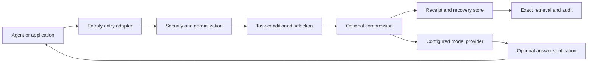

# Entroly Architecture

Entroly is a local context-control plane placed between an AI agent or
application and the model request it produces. It selects evidence under a
budget, preserves recovery information where promised, records the decision,
and can verify the resulting answer. It does not own the conversation or choose
the user's agent.

## System boundary

The provider, agent, and user remain authoritative for model choice,
authentication, conversation state, and tool execution. Entroly changes only
the context surface explicitly placed under its control.

## Layers

| Layer | Primary paths | Responsibility |
| --- | --- | --- |
| Entry adapters | `entroly/cli.py`, `server.py`, `proxy.py`, `integrations/` | CLI, MCP, HTTP, SDK, and agent-specific boundaries |
| Orchestration | `entroly/` | Normalization, routing, receipts, recovery, verification, memory, and policy |
| Native compute | `entroly-core/`, `entroly-qccr/` | Deterministic ranking, selection, compression primitives, and optional proxy binary |
| Node/WASM | `entroly-wasm/`, `entroly/npm/` | Node-first distribution and MCP bridge |
| Evidence | `benchmarks/`, `proofs/`, `docs/public-evidence.md` | Reproducible claims, raw results, and limitations |
| Release system | `.github/workflows/`, `scripts/bump_version.py` | Test matrices, synchronized artifacts, registries, and post-release checks |

## Request lifecycle

1. An entry adapter receives an explicit local input or provider request.
2. Security and privacy gates validate authorization, path scope, prompt
   injection findings, redaction rules, and protocol constraints.
3. The control plane normalizes messages and identifies the task, budget, model
   capability, and cache constraints.
4. Selection ranks evidence using lexical, structural, dependency, learned, or
   optional neural signals available on the installed surface.
5. Compression may compact selected material. Query-agnostic compression must
   not imply preservation of an unknown future answer.
6. A receipt records selected and omitted evidence, warnings, fingerprints,
   token accounting, and the authority used for the decision.
7. The adapter forwards the provider-compliant request or returns selected
   context to the caller.
8. Optional verification evaluates the answer against supplied evidence.
9. Explicit feedback may update local ranking state outside the critical path.

## Trust invariants

- **Exact passthrough on optimization uncertainty.** Internal selection,
  compression, ranking, or metadata errors preserve the original context and
  emit a warning.
- **Fail-closed security and claimed verification.** Authorization, path safety,
  explicit compliance gates, and confidence claims cannot silently downgrade.
- **Receipt honesty.** Receipts distinguish measured, estimated, inferred, and
  unavailable values.
- **Recoverability is scoped.** Exact recovery exists only while the matching
  receipt and recovery store are retained and verified.
- **Local-first behavior.** Ranking, receipts, diagnostics, and verification do
  not make surprise remote calls.
- **Provider compliance.** Model, tools, parameters, ordering, streaming, and
  cache semantics remain unchanged unless the operator explicitly enables and
  receives a receipt for a transformation.
- **Release consistency.** Python, Rust, npm/WASM, MCP, OpenClaw, Docker, binary,
  Homebrew, docs, and native minimum versions are reviewed together.

## State and data ownership

Entroly may create project-local indexes, receipts, recovery bundles, caches,
learned weights, session summaries, and configuration. These artifacts can
contain source-derived data. Callers own retention, backup, encryption, access
control, and secure deletion. Export/import operations must be treated as data
movement, not merely configuration movement.

## Extension boundaries

- Provider and agent adapters translate protocol shapes but must not contain
  ranking policy.
- Ranking and compression policies return explicit decisions and diagnostics;
  callers own forwarding and fallback.
- Optional native acceleration is capability-probed. Importability alone is not
  proof that a required native symbol exists.
- New model metadata carries source and trust labels. Announced or fallback
  metadata cannot authorize destructive compression.
- New receipt fields are additive within a major version; readers ignore
  unknown fields and validate required fields.

## Failure model

| Failure | Required behavior |
| --- | --- |
| Optional optimizer unavailable | Preserve input; expose fallback status |
| Untrusted or unknown context window | Use explicit operator budget or preserve input |
| Receipt write interrupted | Use atomic persistence or report failure; never imply a durable receipt |
| Recovery record missing or tampered | Refuse exactness claim and return an actionable error |
| Provider disconnect or retry exhaustion | Preserve provider status and make retry/failure visible |
| Verification unavailable | Mark result unverified; never convert absence into confidence |
| Release partially publishes | Keep state detectable and rerunnable; do not advertise completion |

## Repository map

See [docs/repo_file_map.md](docs/repo_file_map.md) for a code-derived map,
[docs/architecture.md](docs/architecture.md) for the canonical pipeline, and
[docs/DETAILS.md](docs/DETAILS.md) for subsystem detail.

## Architecture changes

Changes to receipt schemas, network boundaries, provider mutation, persistent
state, public APIs, or trust invariants require a linked issue or RFC, migration
and rollback plans, focused failure tests, and review from the corresponding
code owner. Governance is described in [GOVERNANCE.md](GOVERNANCE.md).
