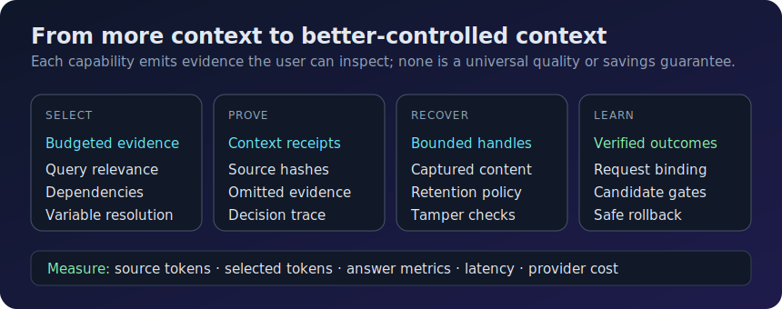
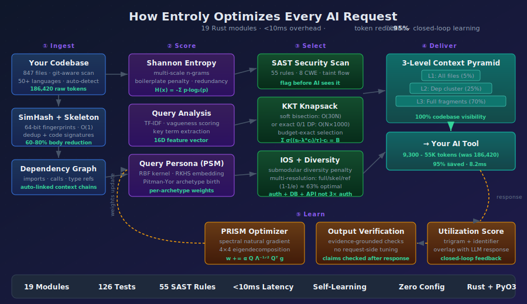

<p align="center">
  
</p>

<h1 align="center">Entroly</h1>

<p align="center">
  <b>The Context Engineering Engine for AI Coding Agents</b>
  <br/>
  <i>Your AI sees 5% of your codebase. Entroly shows it everything — 78% fewer tokens.</i>
</p>

<p align="center">
  <code>pip install entroly</code> &nbsp;&mdash;&nbsp; Works with Cursor, Claude Code, Copilot, Windsurf, OpenClaw
</p>

<p align="center">
  <a href="#install">Install</a> &nbsp;&bull;&nbsp;
  <a href="#see-it-in-action">Demo</a> &nbsp;&bull;&nbsp;
  <a href="#works-with-everything">Integrations</a> &nbsp;&bull;&nbsp;
  <a href="#openclaw-integration">OpenClaw</a> &nbsp;&bull;&nbsp;
  <a href="#cli-commands">CLI</a> &nbsp;&bull;&nbsp;
  <a href="https://github.com/juyterman1000/entroly/discussions">Discuss</a>
</p>

<p align="center">
  
  
  
  
  
  
  
</p>

---

## See It In Action

<p align="center">
  
</p>

> **Run it yourself:** `pip install entroly && entroly demo`
>
> Open the [interactive HTML demo](docs/assets/demo.html) for the full animated experience, or generate your own with `python docs/generate_demo.py`.

---

## The Value

<p align="center">
  
</p>

Every AI coding tool — Cursor, Copilot, Claude Code, Cody — stuffs tokens into the context window until it's full, then cuts. Your AI sees 5-10 files and the rest of your codebase is invisible.

**Entroly fixes this.** It compresses your entire codebase into the context window at variable resolution, removes duplicates and boilerplate, and learns which context produces better AI responses over time.

You install it once. It runs invisibly. Your AI gives better answers and you spend less on tokens.

| Benefit | Details |
|---------|---------|
| **78% fewer tokens per request** | Duplicate code, boilerplate, and low-information content are stripped automatically |
| **100% codebase visibility** | Every file is represented — critical files in full, supporting files as signatures, peripheral files as references |
| **AI responses improve over time** | Reinforcement learning adjusts context selection weights from session outcomes — no manual tuning |
| **Persistent savings tracking** | Lifetime cost savings survive restarts — daily/weekly/monthly trends in the dashboard |
| **Smart auto-config** | `entroly go` detects your project size, language, and team patterns to pick the optimal quality preset |
| **Built-in security scanning** | 55 SAST rules catch hardcoded secrets, SQL injection, command injection, and 5 more CWE categories |
| **Codebase health grades** | Clone detection, dead symbol finder, god file detection — get an A-F health grade for your project |
| **< 10ms overhead** | The Rust engine adds under 10ms per request. You won't notice it |
| **Works with any AI tool** | MCP server for Cursor/Claude Code, or transparent HTTP proxy for anything else |
| **Runs on Linux, macOS, and Windows** | Native support. No WSL required on Windows. Docker optional on all platforms |

---

## Context Engineering, Automated

> *"The LLM is the CPU, the context window is RAM."*

Today, every AI coding tool fills that RAM manually — you craft system prompts, configure RAG, curate docs. **Entroly automates the entire process.**

| Layer | What it solves |
|-------|---------------|
| **Documentation tools** | Give your agent up-to-date API docs |
| **Memory systems** | Remember things across conversations |
| **RAG / retrieval** | Find relevant code chunks |
| **Entroly (optimization)** | Makes everything fit — optimally compresses your entire codebase + docs + memory into the token budget |

These layers are **complementary.** Doc tools give you better docs. Memory gives you persistence. RAG retrieves relevant chunks. Entroly is the **optimization layer** that makes sure all of it actually fits in your context window without wasting tokens.

**Entroly works standalone, or on top of any doc tool, memory system, RAG pipeline, or context source.**

---

## 30-Second Quickstart

```bash
pip install entroly[full]
entroly go
```

**That's it.** `entroly go` auto-detects your project, configures your IDE, picks the optimal quality preset, starts the proxy and dashboard — all in one command.

Then point your AI tool's API base URL to `http://localhost:9377/v1`.

### Or step by step

```bash
pip install entroly                # install
entroly init                       # auto-detect IDE + generate config
entroly proxy --quality balanced   # start the proxy
```

| AI Tool | Setup |
|---------|-------|
| **Cursor** | `entroly init` (generates `.cursor/mcp.json`) |
| **Claude Code** | `claude mcp add entroly -- entroly` |
| **VS Code / Windsurf** | `entroly init` (auto-detected) |
| **Any other tool** | `entroly proxy` → point to `localhost:9377/v1` |

### Verify it's working

```bash
entroly status     # check if the server/proxy is running
entroly demo       # before/after comparison with dollar savings on YOUR project
entroly dashboard  # live metrics: savings trends, health grade, security, PRISM weights
```

### Install options

```bash
pip install entroly           # Core — MCP server + Python fallback engine
pip install entroly[proxy]    # Add proxy mode (transparent HTTP interception)
pip install entroly[native]   # Add native Rust engine (50-100x faster)
pip install entroly[full]     # Everything
```

### Docker

```bash
docker pull ghcr.io/juyterman1000/entroly:latest
docker run --rm -p 9377:9377 -p 9378:9378 -v .:/workspace:ro ghcr.io/juyterman1000/entroly:latest
```

Multi-arch: `linux/amd64` and `linux/arm64` (Apple Silicon, AWS Graviton).

Or with Docker Compose: `docker compose up -d`

---

## Works With Everything

| AI Tool | Setup | Method |
|---------|-------|--------|
| **Cursor** | `entroly init` | MCP server |
| **Claude Code** | `claude mcp add entroly -- entroly` | MCP server |
| **VS Code + Copilot** | `entroly init` | MCP server |
| **Windsurf** | `entroly init` | MCP server |
| **Cline** | `entroly init` | MCP server |
| **OpenClaw** | [See below](#openclaw-integration) | Context Engine |
| **Cody** | `entroly proxy` | HTTP proxy |
| **Any LLM API** | `entroly proxy` | HTTP proxy |

---

## OpenClaw Integration

<a href="https://github.com/openclaw/openclaw">OpenClaw</a> users get the deepest integration. Entroly plugs in as a **Context Engine** that optimizes every agent type automatically:

| Agent Type | What Entroly Does | Token Savings |
|------------|------------------|---------------|
| **Main agent** | Full codebase visibility at variable resolution | ~78% |
| **Heartbeat** | Only loads what changed since last check | ~90% |
| **Subagents** | Parent context inherited + budget-split via Nash bargaining | ~70% per agent |
| **Cron jobs** | Minimal context — just relevant memories + schedule | ~85% |
| **Group chat** | Entropy-based message filtering — only high-signal kept | ~60% |
| **ACP sessions** | Cross-agent context sharing without duplication | ~75% |

When OpenClaw spawns multiple agents, Entroly's **multi-agent budget allocator** splits your token budget optimally across all of them. No agent starves. No tokens wasted.

```python
from entroly.context_bridge import MultiAgentContext

ctx = MultiAgentContext(workspace_path="~/.openclaw/workspace")
ctx.ingest_workspace()

# Spawn subagents with automatic budget splitting
sub = ctx.spawn_subagent("main", "researcher", "find auth bugs")

# Schedule background checks
ctx.schedule_cron("email_checker", "check inbox", interval_seconds=900)

# Every agent gets optimized context automatically
```

---

## How It Works

<p align="center">
  
</p>

1. **Ingest** — Indexes your codebase, builds dependency graphs, fingerprints every fragment for instant dedup
2. **Score** — Ranks fragments by information density — high-value code scores high, boilerplate scores low
3. **Select** — Picks the mathematically optimal subset that fits your token budget, with diversity (auth + DB + API, not 3x auth files)
4. **Deliver** — 3 resolution levels: critical files in full, supporting files as signatures, peripheral files as one-line references
5. **Learn** — Tracks which context produced good AI responses, improves selection weights over time

---

## Why Not Just RAG?

Most AI tools use embedding-based retrieval (RAG). Entroly takes a fundamentally different approach:

| | RAG (vector search) | Entroly |
|--|---------------------|---------|
| **Picks context by** | Cosine similarity to your query | Information-theoretic optimization |
| **Codebase coverage** | Top-K similar files only | 100% — every file represented at some resolution |
| **Handles duplicates** | Sends the same code 3x | SimHash dedup catches copies in O(1) |
| **Learns from usage** | No | Yes — RL updates weights from AI response quality |
| **Dependency-aware** | No | Yes — includes `auth_config.py` when you include `auth.py` |
| **Budget optimal** | Approximate (top-K) | Mathematically optimal (knapsack solver) |
| **Needs embeddings API** | Yes (cost + latency) | No — runs locally in <10ms |

---

## Platform Support

| | Linux | macOS | Windows |
|--|-------|-------|---------|
| **Python 3.10+** | Yes | Yes | Yes |
| **Pre-built Rust wheel** | Yes | Yes (Intel + Apple Silicon) | Yes |
| **Docker** | Optional | Optional (Docker Desktop) | Optional (Docker Desktop) |
| **WSL required** | N/A | N/A | No |
| **Admin rights required** | No | No | No |

---

## CLI Commands

| Command | What it does |
|---------|-------------|
| `entroly go` | **One command to rule them all** — auto-detect, init, proxy, dashboard, smart quality |
| `entroly init` | Detects your project and AI tool, generates config |
| `entroly proxy` | Starts the invisible proxy. Point your AI tool to localhost:9377 |
| `entroly demo` | Before/after comparison with **dollar savings** and file-level breakdown |
| `entroly dashboard` | Live metrics: **lifetime savings trends**, health grade, PRISM weights, security, cache |
| `entroly doctor` | Runs 7 diagnostic checks — finds problems before you do |
| `entroly health` | Codebase health grade (A-F): clones, dead code, god files, architecture violations |
| `entroly role` | Weight presets for your workflow: `frontend`, `backend`, `sre`, `data`, `fullstack` |
| `entroly autotune` | Auto-optimizes engine parameters using mutation-based search |
| `entroly digest` | Weekly summary of value delivered — tokens saved, cost reduction, improvements |
| `entroly status` | Check if server/proxy/dashboard are running |
| `entroly migrate` | Upgrades config and checkpoints when you update Entroly |
| `entroly clean` | Clear cached state and start fresh |
| `entroly benchmark` | Run competitive benchmark: Entroly vs raw context vs top-K retrieval |
| `entroly completions` | Generate shell completions for bash, zsh, or fish |

---

## Production Ready

Entroly is built for real-world reliability, not demos.

- **Persistent value tracking** — lifetime savings stored in `~/.entroly/value_tracker.json`, survives restarts, feeds dashboard trend charts
- **IDE status bar integration** — `/confidence` endpoint delivers real-time optimization confidence for VS Code widgets
- **Rich response headers** — `X-Entroly-Confidence`, `X-Entroly-Coverage-Pct`, `X-Entroly-Cost-Saved-Today` on every response
- **Connection recovery** — auto-reconnects dropped connections without restarting
- **Large file protection** — 500 KB ceiling prevents out-of-memory on giant logs or vendor files
- **Binary file detection** — 40+ file types (images, audio, video, archives, databases) are auto-skipped
- **Crash recovery** — gzipped checkpoints restore state in under 100ms
- **Cross-platform file locking** — safe to run multiple instances
- **Schema migration** — `entroly migrate` handles config upgrades between versions
- **Fragment feedback** — `POST /feedback` lets your AI tool rate context quality, improving future selections
- **Explainable decisions** — `GET /explain` shows exactly why each code fragment was included or excluded

---

## Need Help?

**Self-service:**
```bash
entroly doctor    # runs 7 diagnostic checks automatically
entroly --help    # see all available commands
```

**Get support:**

If you run into any issue, email **autobotbugfix@gmail.com** with:
1. The output of `entroly doctor`
2. A screenshot of the error
3. Your OS (Windows/macOS/Linux) and Python version

We respond within 24 hours.

**Common issues:**

<details>
<summary><b>macOS: "externally-managed-environment" error</b></summary>

Homebrew Python requires a virtual environment:
```bash
python3 -m venv ~/.venvs/entroly
source ~/.venvs/entroly/bin/activate
pip install entroly[full]
```
</details>

<details>
<summary><b>Windows: pip not found</b></summary>

```powershell
python -m pip install entroly
```
</details>

<details>
<summary><b>Port 9377 already in use</b></summary>

```bash
entroly proxy --port 9378
```
</details>

<details>
<summary><b>Rust engine not loading</b></summary>

Entroly falls back to the Python engine automatically. For the Rust speedup:
```bash
pip install entroly[native]
```
If no pre-built wheel exists for your platform, install the [Rust toolchain](https://rustup.rs/) first.
</details>

---

## Part of the Ebbiforge Ecosystem

Entroly integrates with [hippocampus-sharp-memory](https://pypi.org/project/hippocampus-sharp-memory/) for persistent cross-session memory and [Ebbiforge](https://pypi.org/project/ebbiforge/) for TF embeddings and RL weight learning. Both are optional.

---

## Quality Presets

Control the speed vs. quality tradeoff:

```bash
entroly proxy --quality speed       # minimal optimization, lowest latency
entroly proxy --quality fast        # light optimization
entroly proxy --quality balanced    # recommended for most projects
entroly proxy --quality quality     # deeper analysis, more context diversity
entroly proxy --quality max         # full pipeline, best results
entroly proxy --quality 0.7         # or any float from 0.0 to 1.0
```

## Environment Variables

| Variable | Default | What it does |
|----------|---------|-------------|
| `ENTROLY_QUALITY` | `0.5` | Quality dial (0.0-1.0 or preset name) |
| `ENTROLY_PROXY_PORT` | `9377` | Proxy port |
| `ENTROLY_MAX_FILES` | `5000` | Max files to auto-index |
| `ENTROLY_RATE_LIMIT` | `0` | Max requests/min (0 = unlimited) |
| `ENTROLY_NO_DOCKER` | - | Skip Docker, run natively |
| `ENTROLY_MCP_TRANSPORT` | `stdio` | MCP transport (stdio or sse) |

---

<details>
<summary><b>Technical Deep Dive</b></summary>

## How Entroly Compares

| | Cody / Copilot | Entroly |
|--|----------------|---------|
| **Approach** | Embedding similarity search | Information-theoretic compression + online RL |
| **Coverage** | 5-10 files (the rest is invisible) | 100% codebase at variable resolution |
| **Selection** | Top-K by cosine distance | KKT-optimal bisection with submodular diversity |
| **Dedup** | None | SimHash + LSH in O(1) |
| **Learning** | Static | REINFORCE with KKT-consistent baseline |
| **Security** | None | Built-in SAST (55 rules, taint-aware) |
| **Temperature** | User-set | Self-calibrating (no tuning needed) |

## Architecture

Hybrid Rust + Python. All math runs in Rust via PyO3 (50-100x faster). MCP protocol and orchestration run in Python.

```
+-----------------------------------------------------------+
|  IDE (Cursor / Claude Code / Cline / Copilot)             |
|                                                           |
|  +---- MCP mode ----+    +---- Proxy mode ----+          |
|  | entroly MCP server|    | localhost:9377     |          |
|  | (JSON-RPC stdio)  |    | (HTTP reverse proxy)|         |
|  +--------+----------+    +--------+-----------+          |
|           |                        |                      |
|  +--------v------------------------v-----------+          |
|  |          Entroly Engine (Python)             |          |
|  |  +-------------------------------------+    |          |
|  |  |  entroly-core (Rust via PyO3)       |    |          |
|  |  |  21 modules . 380 KB . 249 tests    |    |          |
|  |  +-------------------------------------+    |          |
|  +---------------------------------------------+          |
+-----------------------------------------------------------+
```

## Rust Core (21 modules)

| Module | What | How |
|--------|------|-----|
| **hierarchical.rs** | 3-level codebase compression | Skeleton map + dep-graph expansion + knapsack-optimal fragments |
| **knapsack.rs** | Context subset selection | KKT dual bisection O(30N) or exact 0/1 DP |
| **knapsack_sds.rs** | Information-Optimal Selection | Submodular diversity + multi-resolution knapsack |
| **prism.rs** | Weight optimizer | Spectral natural gradient on 4x4 gradient covariance |
| **entropy.rs** | Information density scoring | Shannon entropy + boilerplate detection + redundancy |
| **depgraph.rs** | Dependency graph | Auto-linking imports, type refs, function calls |
| **skeleton.rs** | Code skeleton extraction | Preserves signatures, strips bodies (60-80% reduction) |
| **dedup.rs** | Duplicate detection | 64-bit SimHash, Hamming threshold 3, LSH buckets |
| **lsh.rs** | Semantic recall index | 12-table multi-probe LSH, ~3 us over 100K fragments |
| **sast.rs** | Security scanning | 55 rules, 8 CWE categories, taint-flow analysis |
| **health.rs** | Codebase health | Clone detection, dead symbols, god files, arch violations |
| **guardrails.rs** | Safety-critical pinning | Criticality levels with task-aware budget multipliers |
| **query.rs** | Query analysis | Vagueness scoring, keyword extraction, intent classification |
| **query_persona.rs** | Query archetype discovery | RBF kernel + Pitman-Yor process + per-archetype weights |
| **anomaly.rs** | Entropy anomaly detection | MAD-based robust Z-scores, grouped by directory |
| **semantic_dedup.rs** | Semantic redundancy removal | Greedy marginal information gain, (1-1/e) optimal |
| **utilization.rs** | Response utilization scoring | Trigram + identifier overlap feedback loop |
| **nkbe.rs** | Multi-agent budget allocation | Arrow-Debreu KKT bisection + Nash bargaining + REINFORCE |
| **cognitive_bus.rs** | Event routing for agent swarms | ISA routing, Poisson rate models, Welford spike detection |
| **fragment.rs** | Core data structure | Content, metadata, scoring dimensions, SimHash fingerprint |
| **lib.rs** | PyO3 bridge | All modules exposed to Python, 249 tests |

## Python Layer

| Module | What |
|--------|------|
| **proxy.py** | Invisible HTTP reverse proxy with `/confidence` and `/trends` endpoints |
| **proxy_transform.py** | Request parsing, context formatting, temperature calibration |
| **value_tracker.py** | Persistent lifetime savings tracker — daily/weekly/monthly trends, atomic writes |
| **server.py** | MCP server with 10+ tools and Python fallbacks |
| **auto_index.py** | File-system crawler for automatic codebase indexing |
| **checkpoint.py** | Gzipped JSON state serialization |
| **prefetch.py** | Predictive context pre-loading |
| **provenance.py** | Hallucination risk detection |
| **multimodal.py** | Image OCR, diagram parsing, voice transcript extraction |
| **context_bridge.py** | Multi-agent orchestration for OpenClaw (LOD, HCC, AutoTune) |

## MCP Tools

| Tool | Purpose |
|------|---------|
| `remember_fragment` | Store context with auto-dedup, entropy scoring, dep linking |
| `optimize_context` | Select optimal context subset for a token budget |
| `recall_relevant` | Sub-linear semantic recall via multi-probe LSH |
| `record_outcome` | Feed the reinforcement learning loop |
| `explain_context` | Per-fragment scoring breakdown |
| `checkpoint_state` | Save full session state |
| `resume_state` | Restore from checkpoint |
| `prefetch_related` | Predict and pre-load likely-needed context |
| `get_stats` | Session statistics and cost savings |
| `health_check` | Clone detection, dead symbols, god files |

## Novel Algorithms

**Entropic Context Compression (ECC)** — 3-level hierarchical codebase representation. L1: skeleton map of all files (5% budget). L2: dependency cluster expansion (25%). L3: submodular diversified full fragments (70%).

**IOS (Information-Optimal Selection)** — Combines Submodular Diversity Selection with Multi-Resolution Knapsack in one greedy pass. (1-1/e) optimality guarantee.

**KKT-REINFORCE** — The dual variable from the forward budget constraint serves as a per-item REINFORCE baseline. Forward and backward use the same probability.

**PRISM** — Natural gradient preconditioning via exact Jacobi eigendecomposition of the 4x4 gradient covariance.

**PSM (Persona Spectral Manifold)** — RBF kernel mean embedding in RKHS for automatic query archetype discovery. Each archetype learns specialized selection weights via Pitman-Yor process.

**ADGT** — Duality gap as a self-regulating temperature signal. No decay constant needed.

**PCNT** — PRISM spectral condition number as a weight-uncertainty-aware temperature modulator.

**NKBE (Nash-KKT Budgetary Equilibrium)** — Game-theoretic multi-agent token allocation. Arrow-Debreu KKT bisection finds the dual price, Nash bargaining ensures fairness, REINFORCE gradient learns from outcomes.

**ISA Cognitive Bus** — Information-Surprise-Adaptive event routing for agent swarms. Poisson rate models compute KL divergence surprise. Welford accumulators detect anomalous spikes in real-time.

## References

Shannon (1948), Charikar (2002), Ebbinghaus (1885), Nemhauser-Wolsey-Fisher (1978), Sviridenko (2004), Boyd & Vandenberghe (Convex Optimization), Williams (1992), Muandet-Fukumizu-Sriperumbudur (2017), LLMLingua (EMNLP 2023), RepoFormer (ICML 2024), FILM-7B (NeurIPS 2024), CodeSage (ICLR 2024).

</details>

---

## License

MIT