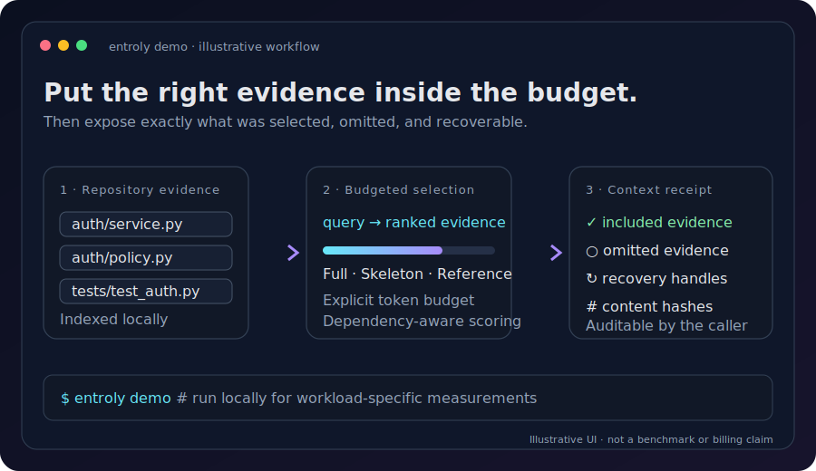
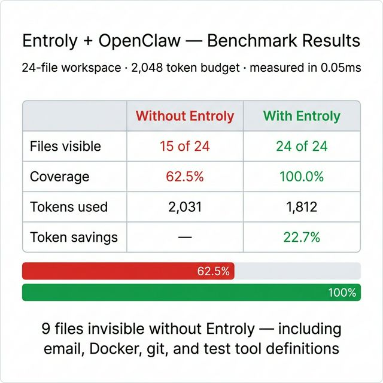

<p align="center">
  
</p>

<h1 align="center">Entroly</h1>

<p align="center">
  <b>Context optimization for AI coding agents.</b>
  <br/>
  <i>Zero config. 78% fewer tokens. Your entire codebase — visible to your AI.</i>
</p>

<p align="center">
  
  
  
  
  
  
  
</p>

---

## See It In Action

<p align="center">
  
</p>

> **Run it yourself:** `pip install entroly && entroly demo`
>
> Open the [interactive HTML demo](docs/assets/demo.html) for the full animated experience, or generate your own with `python docs/generate_demo.py`.

---

## The Value

<p align="center">
  
</p>

Every AI coding tool — Cursor, Copilot, Claude Code, Cody — stuffs tokens into the context window until it's full, then cuts. Your AI sees 5-10 files and the rest of your codebase is invisible.

**Entroly fixes this.** It compresses your entire codebase into the context window at variable resolution, removes duplicates and boilerplate, and learns which context produces better AI responses over time.

You install it once. It runs invisibly. Your AI gives better answers and you spend less on tokens.

| Benefit | Details |
|---------|---------|
| **78% fewer tokens per request** | Duplicate code, boilerplate, and low-information content are stripped automatically |
| **100% codebase visibility** | Every file is represented — critical files in full, supporting files as signatures, peripheral files as references |
| **AI responses improve over time** | Reinforcement learning adjusts context selection weights from session outcomes — no manual tuning |
| **Built-in security scanning** | 55 SAST rules catch hardcoded secrets, SQL injection, command injection, and 5 more CWE categories |
| **Codebase health grades** | Clone detection, dead symbol finder, god file detection — get an A-F health grade for your project |
| **< 10ms overhead** | The Rust engine adds under 10ms per request. You won't notice it |
| **Works with any AI tool** | MCP server for Cursor/Claude Code, or transparent HTTP proxy for anything else |
| **Runs on Linux, macOS, and Windows** | Native support. No WSL required on Windows. Docker optional on all platforms |

---

## Install

```bash
pip install entroly
```

That's it. One command. Works on Linux, macOS, and Windows.

**Windows users:** If `pip` is not on your PATH, use `python -m pip install entroly`.

### Connect to your AI tool

**Cursor** — run `entroly init` in your project. It generates `.cursor/mcp.json` automatically.

**Claude Code** — run `claude mcp add entroly -- entroly`.

**VS Code / Windsurf** — run `entroly init`. Auto-detected.

**Any other AI tool** — use proxy mode:
```bash
pip install entroly[proxy]
entroly proxy --quality balanced
```
Then point your AI tool's API base URL to `http://localhost:9377/v1`. Done.

### Verify it's working

```bash
entroly status     # check if the server/proxy is running
entroly demo       # see a before/after comparison of token savings on your project
entroly dashboard  # open the live metrics dashboard at localhost:9378
```

### Install options

```bash
pip install entroly           # Core — MCP server + Python fallback engine
pip install entroly[proxy]    # Add proxy mode (transparent HTTP interception)
pip install entroly[native]   # Add native Rust engine (50-100x faster)
pip install entroly[full]     # Everything
```

### Docker

```bash
docker pull ghcr.io/juyterman1000/entroly:latest
docker run --rm -p 9377:9377 -p 9378:9378 -v .:/workspace:ro ghcr.io/juyterman1000/entroly:latest
```

Multi-arch: `linux/amd64` and `linux/arm64` (Apple Silicon, AWS Graviton).

Or with Docker Compose: `docker compose up -d`

---

## How It Works

<p align="center">
  
</p>

1. **Ingest** — Auto-indexes your codebase via `git ls-files`, builds dependency graphs, extracts code skeletons, generates SimHash fingerprints for O(1) deduplication
2. **Score** — Shannon entropy scoring identifies high-information fragments. Query analysis routes each request to a learned archetype via Pitman-Yor process + RBF kernel embedding
3. **Select** — KKT-optimal knapsack bisection selects the mathematically optimal context subset within budget. Submodular diversity ensures coverage (auth + DB + API, not 3x auth)
4. **Deliver** — 3-level hierarchical compression: L1 skeleton map (all files), L2 dependency clusters, L3 full fragments. Your AI sees everything at the right resolution
5. **Learn** — PRISM spectral optimizer updates per-archetype weights from LLM response utilization. Context quality improves with every query

---

## Platform Support

| | Linux | macOS | Windows |
|--|-------|-------|---------|
| **Python 3.10+** | Yes | Yes | Yes |
| **Pre-built Rust wheel** | Yes | Yes (Intel + Apple Silicon) | Yes |
| **Docker** | Optional | Optional (Docker Desktop) | Optional (Docker Desktop) |
| **WSL required** | N/A | N/A | No |
| **Admin rights required** | No | No | No |

---

## CLI Commands

| Command | What it does |
|---------|-------------|
| `entroly init` | Detects your project and AI tool, generates config — one command setup |
| `entroly proxy` | Starts the invisible proxy. Point your AI tool to localhost:9377 |
| `entroly demo` | Shows before/after token savings on your actual project |
| `entroly doctor` | Runs 7 diagnostic checks — finds problems before you do |
| `entroly dashboard` | Live metrics: tokens saved, cost reduction, health grade, security findings |
| `entroly health` | Codebase health grade (A-F): clones, dead code, god files, architecture violations |
| `entroly role` | Weight presets for your workflow: `frontend`, `backend`, `sre`, `data`, `fullstack` |
| `entroly autotune` | Auto-optimizes engine parameters using mutation-based search |
| `entroly digest` | Weekly summary of value delivered — tokens saved, cost reduction, improvements |
| `entroly status` | Check if server/proxy/dashboard are running |
| `entroly migrate` | Upgrades config and checkpoints when you update Entroly |
| `entroly clean` | Clear cached state and start fresh |
| `entroly benchmark` | Run competitive benchmark: Entroly vs raw context vs top-K retrieval |
| `entroly completions` | Generate shell completions for bash, zsh, or fish |

---

## Production Ready

Entroly is built for real-world reliability, not demos.

- **Connection recovery** — auto-reconnects dropped connections without restarting
- **Large file protection** — 500 KB ceiling prevents out-of-memory on giant logs or vendor files
- **Binary file detection** — 40+ file types (images, audio, video, archives, databases) are auto-skipped
- **Crash recovery** — gzipped checkpoints restore state in under 100ms
- **Cross-platform file locking** — safe to run multiple instances
- **Schema migration** — `entroly migrate` handles config upgrades between versions
- **Fragment feedback** — `POST /feedback` lets your AI tool rate context quality, improving future selections
- **Explainable decisions** — `GET /explain` shows exactly why each code fragment was included or excluded

---

## Need Help?

**Self-service:**
```bash
entroly doctor    # runs 7 diagnostic checks automatically
entroly --help    # see all available commands
```

**Get support:**

If you run into any issue, email **autobotbugfix@gmail.com** with:
1. The output of `entroly doctor`
2. A screenshot of the error
3. Your OS (Windows/macOS/Linux) and Python version

We respond within 24 hours.

**Common issues:**

<details>
<summary><b>macOS: "externally-managed-environment" error</b></summary>

Homebrew Python requires a virtual environment:
```bash
python3 -m venv ~/.venvs/entroly
source ~/.venvs/entroly/bin/activate
pip install entroly[full]
```
</details>

<details>
<summary><b>Windows: pip not found</b></summary>

```powershell
python -m pip install entroly
```
</details>

<details>
<summary><b>Port 9377 already in use</b></summary>

```bash
entroly proxy --port 9378
```
</details>

<details>
<summary><b>Rust engine not loading</b></summary>

Entroly falls back to the Python engine automatically. For the Rust speedup:
```bash
pip install entroly[native]
```
If no pre-built wheel exists for your platform, install the [Rust toolchain](https://rustup.rs/) first.
</details>

---

## Works with OpenClaw

[OpenClaw](https://openclaw.ai) is a personal AI assistant that manages email, calendar, code, and 50+ integrations — all from WhatsApp, Telegram, or any chat app. Its workspace holds your identity (SOUL.md), persistent memory (MEMORY.md), daily logs, skill definitions, and tool schemas.

The problem: when your OpenClaw agent loads context for a task, it reads files sequentially until the token budget is full — then stops. Your agent can't see files it never loaded.

Entroly fixes this. Measured on a real 24-file OpenClaw workspace:

<p align="center">
  
</p>

<p align="center">
  <b>Benchmark: 2,048 Token Budget (typical heartbeat agent)</b>
</p>

| | Without Entroly | With Entroly |
|--|-----------------|--------------|
| **Files visible to AI** | 15 of 24 | **24 of 24** |
| **Codebase coverage** | 62.5% | **100.0%** |
| **Tokens used** | 2,031 (99.2% of budget) | 1,812 (88.5%) |
| **Token savings** | — | **22.7%** |
| **Optimization time** | — | 0.05ms |

**9 files invisible** without Entroly — including email and system skill definitions, and all tool schemas your agent needs to function:

```
INVISIBLE without Entroly:
  x skills/system.md          — agent can't manage Docker or disk cleanup
  x tools/search_emails.json  — agent can't search your inbox
  x tools/send_email.json     — agent can't send emails
  x tools/disk_usage.json     — agent can't check disk space
  x tools/docker_ps.json      — agent can't list containers
  x tools/read_file.json      — agent can't read code files
  x tools/run_tests.json      — agent can't run your tests
  x tools/git_status.json     — agent can't check repo status
  x tools/web_search.json     — agent can't search the web
```

Your user asks via WhatsApp: _"Check my emails and prep me for standup."_ Without Entroly, your agent literally cannot see the email skill definition. With Entroly, every file is loaded at the right compression level.

> Reproduce this yourself: `python benchmarks/openclaw_benchmark.py`

**Integration — 3 lines of code:**

```python
from entroly.context_bridge import MultiAgentContext

ctx = MultiAgentContext(workspace_path="~/.openclaw/workspace", token_budget=128_000)
ctx.ingest_workspace()

# Main agent — full HCC-optimized context
context = ctx.load_hcc_context(query="check emails and prep for standup", token_budget=8192)

# Cron heartbeat — wakes every 15 min, auto LOD lifecycle
ctx.schedule_cron("email_checker", "check for urgent emails", interval_seconds=900)

# Subagent — inherits parent context, NKBE budget allocation
sub = ctx.spawn_subagent("main", "code_reviewer", "review PR #847 for security issues")
```

**What each component does for OpenClaw:**

| Component | What It Does For Your Agent |
|-----------|---------------------------|
| **HCC Compression** | SOUL.md verbatim, recent logs as skeletons, old logs as one-liners — 100% visibility, 22.7% fewer tokens |
| **NKBE Budget Allocator** | 5 subagents running? Each gets the mathematically optimal token slice via KKT bisection |
| **Cognitive Bus** | Email agent finds something urgent — code agent is notified instantly via ISA-prioritized routing |
| **LOD Manager** | Cron agents sleep at 0 cost between runs, wake to 15% budget on schedule |
| **AutoTune** | Learns that your SOUL.md and recent MEMORY.md entries matter most — weights self-calibrate |

---

## Part of the Ebbiforge Ecosystem

Entroly integrates with [hippocampus-sharp-memory](https://pypi.org/project/hippocampus-sharp-memory/) for persistent cross-session memory and [Ebbiforge](https://pypi.org/project/ebbiforge/) for TF embeddings and RL weight learning. Both are optional.

---

## Quality Presets

Control the speed vs. quality tradeoff:

```bash
entroly proxy --quality speed       # minimal optimization, lowest latency
entroly proxy --quality fast        # light optimization
entroly proxy --quality balanced    # recommended for most projects
entroly proxy --quality quality     # deeper analysis, more context diversity
entroly proxy --quality max         # full pipeline, best results
entroly proxy --quality 0.7         # or any float from 0.0 to 1.0
```

## Environment Variables

| Variable | Default | What it does |
|----------|---------|-------------|
| `ENTROLY_QUALITY` | `0.5` | Quality dial (0.0-1.0 or preset name) |
| `ENTROLY_PROXY_PORT` | `9377` | Proxy port |
| `ENTROLY_MAX_FILES` | `5000` | Max files to auto-index |
| `ENTROLY_RATE_LIMIT` | `0` | Max requests/min (0 = unlimited) |
| `ENTROLY_NO_DOCKER` | - | Skip Docker, run natively |
| `ENTROLY_MCP_TRANSPORT` | `stdio` | MCP transport (stdio or sse) |

---

<details>
<summary><b>Technical Deep Dive</b></summary>

## How Entroly Compares

| | Cody / Copilot | Entroly |
|--|----------------|---------|
| **Approach** | Embedding similarity search | Information-theoretic compression + online RL |
| **Coverage** | 5-10 files (the rest is invisible) | 100% codebase at variable resolution |
| **Selection** | Top-K by cosine distance | KKT-optimal bisection with submodular diversity |
| **Dedup** | None | SimHash + LSH in O(1) |
| **Learning** | Static | REINFORCE with KKT-consistent baseline |
| **Security** | None | Built-in SAST (55 rules, taint-aware) |
| **Temperature** | User-set | Self-calibrating (no tuning needed) |

## Architecture

Hybrid Rust + Python. All math runs in Rust via PyO3 (50-100x faster). MCP protocol and orchestration run in Python.

```
+-----------------------------------------------------------+
|  IDE (Cursor / Claude Code / Cline / Copilot)             |
|                                                           |
|  +---- MCP mode ----+    +---- Proxy mode ----+          |
|  | entroly MCP server|    | localhost:9377     |          |
|  | (JSON-RPC stdio)  |    | (HTTP reverse proxy)|         |
|  +--------+----------+    +--------+-----------+          |
|           |                        |                      |
|  +--------v------------------------v-----------+          |
|  |          Entroly Engine (Python)             |          |
|  |  +-------------------------------------+    |          |
|  |  |  entroly-core (Rust via PyO3)       |    |          |
|  |  |  19 modules . 340 KB . 126 tests    |    |          |
|  |  +-------------------------------------+    |          |
|  +---------------------------------------------+          |
+-----------------------------------------------------------+
```

## Rust Core (19 modules)

| Module | What | How |
|--------|------|-----|
| **hierarchical.rs** | 3-level codebase compression | Skeleton map + dep-graph expansion + knapsack-optimal fragments |
| **knapsack.rs** | Context subset selection | KKT dual bisection O(30N) or exact 0/1 DP |
| **knapsack_sds.rs** | Information-Optimal Selection | Submodular diversity + multi-resolution knapsack |
| **prism.rs** | Weight optimizer | Spectral natural gradient on 4x4 gradient covariance |
| **entropy.rs** | Information density scoring | Shannon entropy + boilerplate detection + redundancy |
| **depgraph.rs** | Dependency graph | Auto-linking imports, type refs, function calls |
| **skeleton.rs** | Code skeleton extraction | Preserves signatures, strips bodies (60-80% reduction) |
| **dedup.rs** | Duplicate detection | 64-bit SimHash, Hamming threshold 3, LSH buckets |
| **lsh.rs** | Semantic recall index | 12-table multi-probe LSH, ~3 us over 100K fragments |
| **sast.rs** | Security scanning | 55 rules, 8 CWE categories, taint-flow analysis |
| **health.rs** | Codebase health | Clone detection, dead symbols, god files, arch violations |
| **guardrails.rs** | Safety-critical pinning | Criticality levels with task-aware budget multipliers |
| **query.rs** | Query analysis | Vagueness scoring, keyword extraction, intent classification |
| **query_persona.rs** | Query archetype discovery | RBF kernel + Pitman-Yor process + per-archetype weights |
| **anomaly.rs** | Entropy anomaly detection | MAD-based robust Z-scores, grouped by directory |
| **semantic_dedup.rs** | Semantic redundancy removal | Greedy marginal information gain, (1-1/e) optimal |
| **utilization.rs** | Response utilization scoring | Trigram + identifier overlap feedback loop |
| **fragment.rs** | Core data structure | Content, metadata, scoring dimensions, SimHash fingerprint |
| **lib.rs** | PyO3 bridge | All modules exposed to Python, 126 tests |

## Python Layer

| Module | What |
|--------|------|
| **proxy.py** | Invisible HTTP reverse proxy |
| **proxy_transform.py** | Request parsing, context formatting, temperature calibration |
| **server.py** | MCP server with 10+ tools and Python fallbacks |
| **auto_index.py** | File-system crawler for automatic codebase indexing |
| **checkpoint.py** | Gzipped JSON state serialization |
| **prefetch.py** | Predictive context pre-loading |
| **provenance.py** | Hallucination risk detection |
| **multimodal.py** | Image OCR, diagram parsing, voice transcript extraction |

## MCP Tools

| Tool | Purpose |
|------|---------|
| `remember_fragment` | Store context with auto-dedup, entropy scoring, dep linking |
| `optimize_context` | Select optimal context subset for a token budget |
| `recall_relevant` | Sub-linear semantic recall via multi-probe LSH |
| `record_outcome` | Feed the reinforcement learning loop |
| `explain_context` | Per-fragment scoring breakdown |
| `checkpoint_state` | Save full session state |
| `resume_state` | Restore from checkpoint |
| `prefetch_related` | Predict and pre-load likely-needed context |
| `get_stats` | Session statistics and cost savings |
| `health_check` | Clone detection, dead symbols, god files |

## Novel Algorithms

**Entropic Context Compression (ECC)** — 3-level hierarchical codebase representation. L1: skeleton map of all files (5% budget). L2: dependency cluster expansion (25%). L3: submodular diversified full fragments (70%).

**IOS (Information-Optimal Selection)** — Combines Submodular Diversity Selection with Multi-Resolution Knapsack in one greedy pass. (1-1/e) optimality guarantee.

**KKT-REINFORCE** — The dual variable from the forward budget constraint serves as a per-item REINFORCE baseline. Forward and backward use the same probability.

**PRISM** — Natural gradient preconditioning via exact Jacobi eigendecomposition of the 4x4 gradient covariance.

**PSM (Persona Spectral Manifold)** — RBF kernel mean embedding in RKHS for automatic query archetype discovery. Each archetype learns specialized selection weights via Pitman-Yor process.

**ADGT** — Duality gap as a self-regulating temperature signal. No decay constant needed.

**PCNT** — PRISM spectral condition number as a weight-uncertainty-aware temperature modulator.

## References

Shannon (1948), Charikar (2002), Ebbinghaus (1885), Nemhauser-Wolsey-Fisher (1978), Sviridenko (2004), Boyd & Vandenberghe (Convex Optimization), Williams (1992), Muandet-Fukumizu-Sriperumbudur (2017), LLMLingua (EMNLP 2023), RepoFormer (ICML 2024), FILM-7B (NeurIPS 2024), CodeSage (ICLR 2024).

</details>

---

## License

MIT
