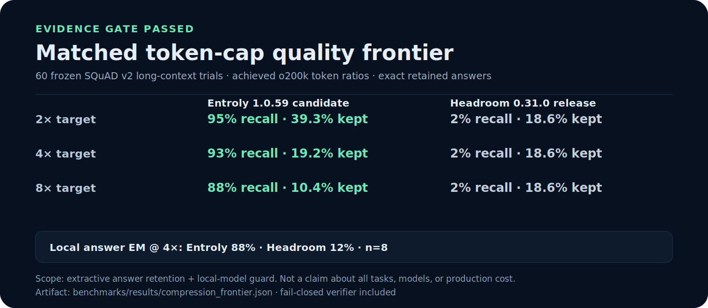
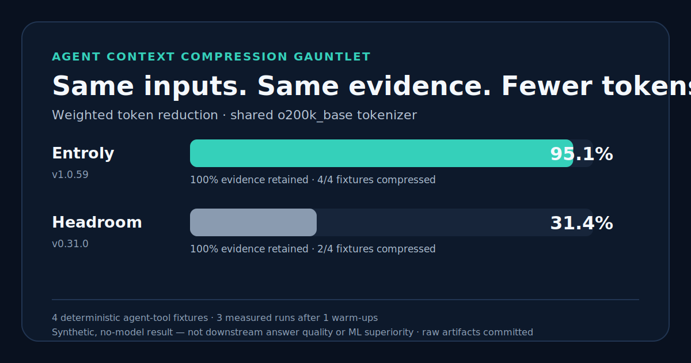

<p align="center">
  
</p>

<p align="center"><b>Know exactly what your AI agent saw.</b><br>
Entroly creates replayable <b>Context Commits</b>: content-addressed proof of the evidence selected, omitted, and kept recoverable for each model request.</p>

<p align="center">
  <sub>Integrates with Cursor, Claude Code, Codex, Aider, OpenClaw, MCP clients, and custom provider applications. Choose the supported setup path for your client.</sub>
</p>

<p align="center">
  <sub>Auditable context control plane · receipt-producing selection paths record what was used, what was omitted, and residual risks · local-first · Python with optional Rust acceleration · Node/WASM runtime</sub>
</p>

<!-- Distribution and licensing: registry badges report live package metadata. -->
<p align="center">
  <a href="https://pypi.org/project/entroly/"></a>
  <a href="https://www.npmjs.com/package/entroly"></a>
  <a href="LICENSE"></a>
</p>

<!-- Reproducible evidence: every badge links to the exact committed artifact. -->
<p align="center">
  <a href="benchmarks/results/context_commit_conformance.json"></a>
  <a href="benchmarks/results/halueval_qa_faithful.json"></a>
  <a href="docs/product-surface.md"></a>
  <a href="#proof"></a>
</p>

<!-- Community signals are not product or benchmark verification. -->
<p align="center">
  <a href="https://github.com/juyterman1000/entroly"></a>
  <a href="https://juyterman1000.github.io/entroly/docs/discord.html"></a>
</p>

<p align="center"><sub>Registry badges show distribution metadata. Evidence badges link to committed results with scope and caveats. Community and marketplace status are not treated as technical proof.</sub></p>

<p align="center">
  <code>pip install -U entroly && cd /your/repo && entroly verify-claims && entroly simulate</code>
</p>

<p align="center">
  <a href="#get-started"><b>Get started</b></a> ·
  <a href="#proof"><b>Proof</b></a> ·
  <a href="#works-with-your-stack"><b>Integrations</b></a> ·
  <a href="#whats-inside"><b>What's inside</b></a> ·
  <a href="docs/DETAILS.md"><b>Architecture</b></a> ·
  <a href="docs/for-teams.md"><b>For teams</b></a> ·
  <a href="docs/limitations.md"><b>Limitations</b></a>
</p>

<p align="center">
  <b>Deciding whether to star?</b> Run the no-key proof first: <code>entroly verify-claims && entroly simulate</code>.<br>
  <sub>If it finds meaningful savings or gives you auditable receipts on your repo, star it so other agent builders can find it. If it does not, open an issue with the verification JSON.</sub>
</p>

---

## What it does

Entroly is an auditable context control plane for AI agents. It decides what context to send, records what it left out, and produces a receipt you can inspect before trusting a hard multi-file answer.

**OpenClaw runs the agents and conversations. Entroly controls, remembers, verifies, and proves the context those agents received.** The same boundary applies to Claude Code and Codex: Entroly augments the agent you already use instead of becoming another chat client.

Most compression tools shrink whatever text the agent already chose. Entroly starts one step earlier: it chooses the highest-value evidence first, compresses only after selection, keeps originals recoverable, then verifies the answer against the evidence.

- **Receipts** - every selection run can explain selected chunks, omitted nearby evidence, dependency links, fingerprints, token ratio, and residual risks.
- **Select** - ranks your repo or document set, then sends the answer-relevant context under a token budget.
- **Verify** - WITNESS can check an answer against supplied evidence locally, without an additional model call. See the scoped benchmark under [Proof](#proof).
- **Route** - sends easy, repeated tasks to a cheaper model and keeps the flagship for hard ones (opt-in, fail-closed).
- **Cache-align** - keeps the injected prefix byte-stable so provider prefix caches can keep hitting where terms and API shape allow it.
- **Learn** - adapts local ranking signals from recorded outcomes. No embeddings API or training job is required for that path.

Use it however you work: **wrap** your agent, run it as a **proxy**, plug it in as an **MCP server**, or import the **library**.

### Why teams care

| What usually breaks AI coding at scale | What Entroly adds |
|---|---|
| Context windows fill with logs, duplicate files, and irrelevant chunks | Budgeted selection that favors answer-critical files, dependency links, failures, and anomalies |
| Token savings look good but quality silently drops | Accuracy-retention benchmarks, receipts, and WITNESS verification |
| Agents lose the exact line, stack trace, or omitted file they later need | Reversible compressed fragments and retrieval handles |
| First-time setup depends on one IDE or one provider | CLI, SDK, MCP, proxy, npm, PyPI, Docker, and local simulation paths |
| Enterprise teams need proof, not screenshots | Committed JSON artifacts, local self-tests, and reproducible commands |

### Product surface

Entroly ships as a full local runtime, not one proxy command:

| Surface | What users get |
|---|---|
| **CLI** | `attach`, `context-commit`, `verify-claims`, `simulate`, `perf`, `wrap`, `proxy`, `serve`, `daemon`, `benchmark`, `witness`, `receipt`, `audit`, `doctor`, `health`, `batch`, `learn`, `ravs`, `cache`, and more |
| **SDK** | `compress`, `compress_messages`, `optimize`, `verify`, hallucination detection, Context Receipts, localizers, cache alignment, cost cortex, Memory OS |
| **MCP server** | Context optimization, exact retrieval, receipts, recovery, feedback, security scans, codebase health, smart reads, belief verification, response verification |
| **Proxy** | Anthropic/OpenAI-compatible local optimization path for API-key users and custom apps |
| **Node/WASM** | `entroly`, `entroly-mcp`, and `entroly-wasm` packages for npm users |
| **Trust layer** | WITNESS, EICV, STAVE, receipt proofs, provenance checks, prompt-injection scanning, and local verification reports |
| **Memory/session intelligence** | Memory OS, Memory Fabric, long-term memory, session digests, checkpoint relevance, cache-retention forecasting, and lifetime value tracking |
| **Multimodal intake** | Diff, diagram, voice, image, and structured-context ingestion with provider-aware image token estimates and compliance-gated optimization |
| **Gateway/accounting** | Provider capability planning, failover policy, redaction receipts, usage ledger, cache routing, spend math, and budget harnesses |
| **Model intelligence** | Bundled trust-labelled model metadata plus opt-in OpenRouter and local Ollama/LM Studio discovery; remote credentials are never persisted |
| **Knowledge vault/CogOps** | Belief compilation, vault search, workspace change sync, epistemic routing, verification engines, and flow orchestration |
| **Framework/event gateways** | LangChain helpers, Ebbiforge provenance auditing, AgentSkills export, Hermes, Slack, Discord, and Telegram gateway hooks for teams that want operational feedback loops |
| **Self-improvement** | PRISM/RAVS feedback, autotune, skill crystallization, promotion gates, evolution logging, and budget-gated skill synthesis |
| **Observability** | Dashboard, daemon supervisor, control plane, health reports, value tracker, release-surface checks, and local JSON proof reports |

Under the hood, the Python control plane has a pure-Python path and can use the
optional Rust extension for supported operations. The separate Node runtime
uses WASM. The implementation includes BM25, entropy scoring, SimHash dedup,
dependency graphs, budgeted selection, caching, verification, and memory
primitives; installed capabilities depend on the selected package and extras.

See the full code-derived map in [docs/product-surface.md](docs/product-surface.md).

---

## How it works (30 seconds)

```
your agent  ──►  Entroly (local)  ──►  LLM provider
                 │
                 ├─ rank the repo        (BM25 + entropy + dep-graph)
                 ├─ select under budget  (knapsack, reversible)
                 ├─ emit receipt         (included, omitted, risks)
                 ├─ cache-align prefix    (keep provider cache hot)
                 └─ verify the reply      (WITNESS hallucination guard)
```

Critical files go in full. Supporting files can become signatures. Other material can become a reference that can be expanded on demand. Exact recovery is available only while the corresponding receipt and recovery store are retained; deleting that state deletes Entroly's recovery path.

---

## Get started

The best first run is local and proof-driven. It should work before you connect
an API key, proxy, paid model, or enterprise setup.

```bash
pip install -U entroly     # or: npm i -g entroly  ·  brew install juyterman1000/entroly/entroly
```

**1. Prove the package works on your machine:**

```bash
entroly verify-claims      # SDK import, indexing, optimization, exact recovery, engine mode
entroly simulate           # local no-LLM savings estimate on your current repo
```

**2. Pick one integration path:**

| You are using | Run this | Why |
|---|---|---|
| Claude Code subscription | `entroly attach create --client claude --project . --ttl 4h --install` | Installs scoped, expiring MCP access without placing a bearer token in process arguments |
| Codex or OpenClaw | `entroly attach create --client codex --project . --ttl 4h --install` | Binds Entroly to this project with revocable least-privilege access; replace `codex` with `openclaw` as needed |
| Cursor, VS Code, Windsurf, or another MCP client | `entroly init`, or register `entroly` as a stdio command with no arguments | Local MCP tools without requiring Docker |
| Pay-as-you-go API keys or a custom app | `entroly proxy` | Transparent Anthropic/OpenAI-compatible optimization path |
| Python app | `from entroly import compress, compress_messages, optimize` | Direct SDK control |
| Node/npm workflow | `npm install -g entroly` | WASM runtime without a Python-first setup |
| CI or release gate | `entroly batch --budget 8000 --fail-over-budget` | Enforce prompt budgets before merge |

**3. Best setup for Claude Code subscription users:**

```bash
entroly attach create --client claude --project . --ttl 4h --install
```

Claude Code stays your client. Entroly adds only the granted tools for compression, retrieval, receipts, and verification. Revoke access at any time with `entroly attach revoke <grant-id> --uninstall`; every tool call re-checks the grant, expiry, project, and scope.

**4. One command — auto-detects your IDE, wraps your agent, opens the dashboard:**

```bash
cd /your/repo && entroly go
```

**5. Or wrap a specific agent:**

```bash
entroly wrap claude     # Claude Code
entroly wrap cursor     # Cursor
entroly wrap codex      # Codex CLI
entroly wrap aider      # Aider
```

**6. Or run the proxy — best for pay-as-you-go API keys and custom apps:**

```bash
entroly proxy                                   # http://localhost:9377
ANTHROPIC_BASE_URL=http://localhost:9377     your-app
OPENAI_BASE_URL=http://localhost:9377/v1     your-app
GOOGLE_GEMINI_BASE_URL=http://localhost:9377/v1beta     your-app
```

**7. Or measure it on your own repo first:**

```bash
entroly demo            # before/after token + cost estimate
entroly simulate        # local no-LLM savings estimate
entroly perf            # local no-LLM savings + optimizer latency
entroly verify-claims   # runs the packaged self-test, writes a JSON report
```

> Local-first: Entroly performs indexing and selection on-device. The selected
> prompt is sent only through the model integration you configure. Entroly does
> not send outbound analytics by default. Apache-2.0.

### First-run success contract

Entroly should feel useful before you connect a paid model key:

- `entroly verify-claims` proves SDK import, local indexing, optimization, exact recovery, and native/pure-Python engine mode.
- `entroly simulate` shows the likely token reduction on your repo without making an LLM call.
- MCP setup works for Claude Code subscription users who do not want proxy/API-key mode.
- Proxy mode is available when you control the provider key and want transparent request optimization.
- npm/WASM is available for Node-first users, but Python remains the fullest CLI/SDK path.

If your repo is tiny or already under budget, Entroly should say so and pass through rather than invent fake savings.

---

## Context Commits

A Context Commit is a portable JSON artifact for the exact context selected for
an agent request. It binds the ordered selected text, omitted evidence, exact
recovery data, engine/version identity, and optional parent lineage to one
content-addressed `ctx_...` identifier.

```bash
entroly context-commit ./repo --query "Where is token rotation enforced?" \
  --budget 8000 --out context-commit.json
entroly context-commit --verify context-commit.json
```

```python
from entroly import create_context_commit, replay_context, verify_context_commit

commit = create_context_commit(
    [("auth.py", open("auth.py", encoding="utf-8").read())],
    query="Where is token rotation enforced?",
    token_budget=8000,
)
assert verify_context_commit(commit).valid
exact_context = replay_context(commit)
```

The artifact is self-contained and therefore may contain source text in its
recovery bundle. Keep it under the same access and retention policy as the
source repository. Content addressing proves mutation, not signer identity;
use Entroly's optional Ed25519 attestation and Merkle-log APIs when custody or
operator identity matters. [Contract and threat model](docs/context-commits.md).

---

## Context Receipts

Receipt-producing selection workflows record what was used, what was omitted,
why, and what risks remain. This is useful for hard multi-document work such as
contracts, policies, addenda, code reviews, and audit evidence where a bare
top-k result is not enough.

```bash
entroly ingest ./docs
entroly select --query "Does this contract have a change-of-control clause?" --budget 8000
entroly receipt .entroly/receipts/cr_example.json
entroly audit .entroly/session_chain.json
entroly explain --why-omitted chk_example --receipt .entroly/receipts/cr_example.json
```

The receipt JSON includes selected chunks, omitted relevant chunks, ranking reasons, dependency links, source fingerprints, token ratio, warnings, and a reproducibility hash. The Markdown report is designed for human review before a compressed context is trusted.

Implementation notes:

- Rust core (`entroly-core/src/context_receipts.rs`) handles deterministic ingestion, BM25-style ranking, dependency scans, selection, and hashes when the native wheel is available.
- Python control plane (`entroly/context_receipts/`) provides CLI wiring and a pure-Python fallback for source checkouts.
- The semantic/vector scorer and reranker are explicit extension points; the local MVP ships with lexical scoring and dependency heuristics, not a legal-accuracy guarantee.

Examples:

- [Example receipt JSON](docs/examples/context_receipt.json)
- [Example Markdown report](docs/examples/context_receipt.md)
- [Limitations](docs/limitations.md#context-receipts)

---

## Proof

**Context Commit conformance** (synthetic deterministic code fixtures, local,
no model or network calls):

| Integrity property | Committed result |
|---|---:|
| Deterministic replay across Python + Rust modes | **128 / 128** |
| Exact recovery of omitted chunks | **576 / 576** |
| Tamper mutations detected | **768 / 768** |

Reproduce: `python -m benchmarks.context_commit_conformance`.
[Raw JSON](benchmarks/results/context_commit_conformance.json). These numbers
measure artifact integrity, replay, and recovery on the committed fixtures;
they do not measure model-answer quality or claim identical Python/Rust selection.

**Context Efficiency Frontier research:** Entroly is building a paired,
model-neutral benchmark for the question token-savings tables cannot answer:
does less context preserve real task quality? The preregistered protocol
compares raw context, model-native compaction, Entroly, and their combination
using provider-observed tokens, cost, latency, task success, evidence recall,
and unsupported claims.

[Read the preregistered protocol](docs/benchmarks/context-efficiency-frontier.md).
No headline result will be claimed until the paired confidence bounds pass.

**Matched token-cap active-context quality frontier (1.0.59 source candidate):**
across 60 frozen SQuAD v2 long-context RAG/tool-result trials, without expanding
Headroom's CCR retrieval pointers, Entroly retained **95.0%**,
**93.3%**, and **88.3%** of accepted answers at the 2x, 4x, and 8x token caps.
Published Headroom 0.31.0 retained **1.7%** at each cap. The paired two-sided
exact McNemar tests pass at every point (`p <= 4.45e-16`). Entroly met all 180
caps; Headroom met the 2x/4x caps but missed all 60 8x caps, keeping 18.6% of
tokens instead of at most 12.5%.

| Maximum token cap | Entroly answer retained / actual kept | Headroom answer retained / actual kept |
|---:|---:|---:|
| 2x (50%) | **95.0% / 39.3%** | 1.7% / 18.6% |
| 4x (25%) | **93.3% / 19.2%** | 1.7% / 18.6% |
| 8x (12.5%) | **88.3% / 10.4%** | 1.7% / 18.6% (cap missed) |

A separate eight-question, randomized local `qwen2.5:1.5b` guard at 4x scored
raw context at 62.5% exact match, Entroly at **87.5%**, and Headroom at 12.5%,
with no errors. This small local-model sample is a veto guard, not the headline
or a frontier-model claim.

[Generated report](benchmarks/results/compression_frontier.md) ·
[full auditable artifact](benchmarks/results/compression_frontier.json) ·
[protocol and reproduction](docs/benchmarks/compression-frontier.md). Verify it
with `python -m benchmarks.compression_frontier verify benchmarks/results/compression_frontier.json`.

<sub>Scope: extractive answer retention in structured SQuAD-v2 RAG results.
Headroom's CCR pointers remain in its output, but retrieval recovery is not run;
this measures immediately visible active context, not Headroom's end-to-end CCR
workflow. Entroly is measured from the 1.0.59 source
candidate; do not call this a released-package result until 1.0.59 is
published. This does not establish superiority for every task, model,
compressor, or production workload.</sub>

<p align="center">
  <a href="benchmarks/results/compression_frontier.md"></a>
</p>

**Same-input compression gauntlet:** on four deterministic agent-tool fixtures,
current Entroly source (package version `1.0.59`) and Headroom `0.31.0`
both retained **100% of the preregistered answer evidence**. Under the shared
`o200k_base` tokenizer, Entroly reduced weighted input tokens by **95.1%** versus
**31.4%** for Headroom's public `compress()` pipeline with its documented
`agent-90` high-savings profile. Entroly compressed all four fixtures; Headroom
compressed two and safely passed two through.

[Generated report](benchmarks/results/compression_gauntlet.md) ·
[raw inputs and outputs](benchmarks/results/compression_gauntlet.json) ·
[protocol and reproduction](docs/benchmarks/compression-gauntlet.md). Verify the
artifact with `python -m benchmarks.compression_gauntlet verify benchmarks/results/compression_gauntlet.json`.

<sub>This is a synthetic, no-model compression/evidence result. It does not
measure downstream answer quality or establish neural/ML superiority. The
Context Efficiency Frontier above is the required gate for a real-model claim.</sub>

<p align="center">
  <a href="benchmarks/results/compression_gauntlet.md"></a>
</p>

**Cross-process recovery holdout:** the preregistered six-writer test first
exposed a serious Entroly failure (only 8/32 development payloads survived),
which is preserved in the evidence. The original Entroly 1.0.59 holdout and
the immutable v2 revalidation both recorded Entroly and published Headroom
0.31.0 recovering **66/66** payloads. On the fresh-seed v3 revalidation of the
current complete-line recovery implementation, Entroly again recovered
**66/66** byte-exactly; Headroom recovered **55/66** after one of six writers
exited with SQLite `database is locked`. Entroly alone satisfied the frozen
integrity gate on this run. That is a scoped concurrent-writer reliability
result; it does not establish universal recovery superiority.

On the current-implementation Windows/Python 3.10 revalidation, Headroom had
lower successful store-call latency (1.786 ms versus 36.972 ms p50). Entroly
had lower retrieval latency (0.165 ms versus 0.876 ms p50) and a smaller live
state footprint (95,438 versus 1,354,888 bytes). Headroom used SQLite WAL with
`synchronous=NORMAL`; Entroly
fsynced its state file on each commit, so this is not a matched power-loss
durability comparison. These are scoped workload measurements, not universal
claims.

[Frozen protocol and full result table](docs/benchmarks/competitive-evidence-matrix.md)
| [current v3 revalidation](benchmarks/results/recovery_resilience_holdout_revalidation_v3.json) |
[prior v2 tie](benchmarks/results/recovery_resilience_holdout_revalidation.json) |
[original post-repair holdout](benchmarks/results/recovery_resilience_holdout.json) |
[original failing artifact](benchmarks/results/recovery_resilience_development_before.json).

**Quality-gated compression latency holdout:** on the same four deterministic
agent-tool fixtures and public entry points as the gauntlet, Entroly 1.0.59
source was **2.94x faster** than published Headroom 0.31.0 for warm compressor
calls (95% bootstrap CI **2.74x–3.13x**) and **2.39x faster** for product import
plus the first call in a fresh process (**1.89x–2.70x**). Both systems completed
every fixture, retained 100% of preregistered evidence, remained deterministic,
and never inflated tokens.

[Protocol, per-fixture timings, and limits](docs/benchmarks/compression-latency.md)
| [full holdout artifact](benchmarks/results/compression_latency_holdout.json)
| [development artifact](benchmarks/results/compression_latency_development.json).

<sub>Scope: Windows/Python 3.10, synthetic local compression, 120 warm and 40
cold observations per participant. Cold excludes interpreter startup and
includes product import plus first call. This is not provider latency,
downstream answer quality, neural superiority, or universal product
superiority.</sub>

**Model-triggered recovery holdout:** after compression for one question, a
different future audit question was revealed to a local `qwen2.5:1.5b` guard.
On 24 frozen query-shift cases, raw context and Entroly both scored **24/24
exact**; published Headroom 0.31.0 scored **18/24**. All six paired differences
favored Entroly (two-sided exact McNemar **p = 0.03125**). Entroly's mean
effective context ratio, including recovery evidence on every triggered retry,
was **28.88%** versus **42.97%** for Headroom.

Every Entroly row triggered retrieval and recovered a complete source-exact
JSON object; Headroom answered 18 rows from active context and returned a wrong
value rather than exact `RETRIEVE` on the other six, so the no-oracle protocol
did not retrieve for them. The complete artifact passed the strengthened
verifier with zero execution errors.

[Protocol, rejected variants, reproduction, and limits](docs/benchmarks/model-triggered-recovery.md)
| [full holdout artifact](benchmarks/results/model_recovery_v7_holdout.json)
| [development artifact](benchmarks/results/model_recovery_v7_development.json).

<sub>Scope: synthetic 48-record JSON audit logs, Windows/Python 3.10, 24
holdout cases, local Qwen2.5 1.5B Q4_K_M at temperature zero. Headroom recovery
uses its public `compress()` plus persistent `CompressionStore` contract; MCP
transport is excluded. This is a scoped workflow result, not evidence about
hosted frontier models, every agent workload, provider cost, or overall product
superiority.</sub>

**PRISM-R neural research preview:** a generic MiniLM encoder did **not** beat
BM25 as a primary paragraph scorer (97.7% versus 99.0% held-out evidence
recall), so Entroly rejects that neural-primary claim. A disagreement guard
reached 99.3% while selecting 1.02 of 16 passages on average. In a separate
200-pair query-shift pilot at a nominal 25% active budget, PRISM-R retained
87.0% of current-query evidence versus lexical selection's 60.5%; when a
different future question was revealed, exact receipt-backed rehydration raised
its evidence retention from 9.0% to 90.5%. Active plus recovered context was
50.6% of the original.

[Research design and prior art](docs/research/prism-r-neural-compression.md) ·
[held-out retrieval artifact](benchmarks/results/neural_evidence_frontier.json) ·
[query-shift artifact](benchmarks/results/neural_query_shift.json).

<sub>These are offline exact-evidence pilots on frozen SQuAD v2 subsets, not
downstream answer-quality, latency, production-savings, or general neural
superiority claims. PRISM-R remains opt-in research code.</sub>

The tables below link each reported number to its committed result. Treat them
as evidence for those specific datasets, budgets, models, and commits—not as a
guarantee for another repository. `entroly simulate` uses a local token
estimate; use provider-observed usage for a billing or production claim.

**Accuracy retention** — does compression hurt answers? Measured with `gpt-4o-mini`; intervals are Wilson 95% CIs. Each row links its raw result file.

| Benchmark | n | Budget | Baseline | With Entroly | Retention | Token savings |
|---|---|---|---|---|---|---|
| [NeedleInAHaystack](benchmarks/results/needle_accuracy.json) | 20 | 2K | 100% | 100% | **100%** | **99.5%** |
| [LongBench (HotpotQA)](benchmarks/results/longbench_accuracy.json) | 50 | 2K | 64% | 66% | **103%** | **85.3%** |
| [Berkeley Function Calling](benchmarks/results/bfcl_accuracy.json) | 50 | 500 | 100% | 100% | **100%** | **79.3%** |
| [SQuAD 2.0](benchmarks/results/squad_accuracy.json) | 50 | 100 | 80% | 72% | **90%** | **43.8%** |
| [GSM8K](benchmarks/results/gsm8k_accuracy.json) | 20 | 50K | 85% | 85% | **100%** | pass-through* |

<sub>*pass-through: context already fit the budget, so Entroly left it unchanged. Reproduce: `python benchmarks/run_readme_benchmarks.py` (needs `OPENAI_API_KEY`). Full table + MMLU/TruthfulQA in [DETAILS](docs/DETAILS.md).</sub>

**Hallucination detection** — committed [HaluEval-QA](https://github.com/RUCAIBox/HaluEval)
balanced, both-answers-scored run:

| Result | Decisions | Accuracy | AUROC | Scope |
|---|---:|---:|---:|---|
| WITNESS full benchmark | 20,000 | 84.92% on the 16,000-decision held-out split | **0.7976** | Local, deterministic verifier |
| WITNESS on the shared GPT sample | 1,200 | 86.58% | 0.8132 | Same sampled decisions used for the GPT rows |
| gpt-4o-mini on the shared sample | 1,200 | 86.25% | not reported | API judge comparison only |

Reproduce: `python benchmarks/halueval_qa_faithful.py`.
[Protocol and raw result](benchmarks/results/halueval_qa_faithful.json). The
shared-sample accuracies overlap within their reported uncertainty; this result
does not establish superiority, general hallucination prevention, or production
answer quality. The separate [STAVE exploratory result](benchmarks/results/stave_benchmark.json)
is not used for the headline because it follows a different evaluation setup.

---

## Works with your stack

### OpenClaw: keep the evidence uniform compression drops

OpenClaw remains the conversation and agent runtime. Attach Entroly as its context control plane with `entroly attach create --client openclaw --project . --ttl 4h --install`.

The OpenClaw context-engine plugin keeps context assembly separate from provider
routing. The same assembly path can be used with OpenAI, Anthropic, Gemini,
Nemotron, OpenRouter, Ollama, and custom routes because OpenClaw owns routing
and authentication and supplies the resolved prompt budget. Entroly preserves
opaque provider blocks and delegates `/compact` and overflow recovery back to
OpenClaw.

The beta OpenClaw context engine scores older messages against the current
request. Matching evidence is pinned verbatim when it fits a bounded reserve;
lower-value history is compressed around it, and every decision is written to
a local receipt.

In the committed synthetic, no-model control below, both strategies fit the
same 1,800-token estimated budget. Uniform compression lost the exact old
authentication instruction; evidence pinning retained it byte-for-byte.

| Strategy | Estimated assembled tokens | Exact evidence retained |
|---|---:|---:|
| Uniform budget compression | 1,797 | No |
| Entroly evidence pinning | 1,793 | **Yes** |

Reproduce locally: `python -m benchmarks.openclaw_evidence_pinning`.
[Benchmark JSON](benchmarks/results/openclaw_evidence_pinning.json) ·
[Plugin setup](integrations/openclaw/README.md)

<sub>Synthetic deterministic normalized multi-provider workload, 23,089 estimated source tokens, 11
messages, zero model calls. Token counts are estimates, not billed usage, and
this result does not establish downstream model accuracy.</sub>

`entroly wrap <agent>` picks the best integration for each tool — proxy env-wrap for CLIs, auto-merged `mcp.json` for MCP-aware IDEs, or a best-effort endpoint/config hint.

**Wrap in one command:** `claude` · `cursor` · `codex` · `aider` · `gemini` · `windsurf` · `vscode` · `zed` · `cline` · `continue` and **28 more**.

<details>
<summary><b>Full agent list (38 targets)</b></summary>

| Type | Agents |
|---|---|
| **CLI (env-wrap + exec)** | Claude Code, Codex CLI, Aider, Gemini CLI, Qwen Code, OpenCode, Charm CRUSH, Hermes, Pi, Ollama |
| **MCP IDEs (auto-merge `mcp.json`)** | Cursor, Windsurf, VS Code, Claude Desktop, Claude Code (MCP), Zed |
| **Copy-paste endpoint** | Cline, Roo Code, Continue, Cody, Amp, Kiro, Qoder, Trae, Antigravity, Amazon Q, Verdent, JetBrains AI, Helix, Tabby, Twinny, Sublime, Emacs, Neovim, Fitten, Tabnine, Supermaven |

Any tool that supports a custom `OPENAI_BASE_URL` / `ANTHROPIC_BASE_URL` works via the proxy. Run `entroly wrap` (no agent) for the full grouped list. Use wrappers only with tools whose terms permit local proxies / custom endpoints.
</details>

**As a library** (LangChain, LlamaIndex, your own code):

```python
from entroly import compress, compress_messages, optimize

compressed = compress(api_response, budget=2000)          # query-agnostic
messages   = compress_messages(messages, budget=30000)    # whole conversation
gentle     = compress_messages(messages, target_ratio=0.90)  # smooth relative operating point
context    = optimize(fragments, budget=8000, query="fix the login bug")  # task-conditioned
```

`compress_messages` infers the final user turn as the task and uses it to
prioritize answer-relevant evidence in older context. `target_ratio` is based on
Entroly's dependency-free token estimate; measure provider-observed tokens with
the [Context Efficiency Frontier](docs/benchmarks/context-efficiency-frontier.md)
before publishing a savings claim.

**In CI** — fail the build if a prompt blows the token budget:

```yaml
- run: pip install entroly && entroly batch --budget 8000 --fail-over-budget
```

---

## When to use it · when to skip

**Great fit**
- Large repos where the agent only sees a few files at a time
- Chatty, multi-turn agents (cache alignment compounds the savings)
- Anywhere you want answers checked against evidence before you trust them
- Teams trying to cut a real, growing AI bill

**Skip it (it'll just pass through)**
- Tiny repos or short prompts that already fit the budget
- Judgment-heavy tasks where you want the full flagship model every time

---

## What's inside

Entroly exposes **19 local control mechanisms** across input, inference, output,
verification, and learning. The table describes their role and source location;
it does not assign an unmeasured savings percentage to each mechanism.

<details>
<summary><b>The 19 mechanisms (and the file that implements each)</b></summary>

| # | Mechanism | Role | Source |
|---|---|---|---|
| 1 | Context compression (knapsack + compressors + dep-graph) | Select and transform context under an explicit budget | `proxy_transform.py`, `qccr.py` |
| 2 | WITNESS + STAVE verification gateway | Produce local grounding-risk signals; benchmark protocols remain separate | `witness.py`, `verifiers/stave.py` |
| 3 | Cache Aligner | Preserve eligible prompt-prefix bytes for provider cache reuse | `cache_aligner.py` |
| 4 | Escalation cascade (conformally calibrated) | Gate opt-in escalation under configured confidence policy | `escalation.py` |
| 5 | Conformal cascade | Calibrate a cost/coverage operating point | `conformal_cascade.py` |
| 6 | RAVS Bayesian router | routes easy tasks to cheaper models | `ravs/router.py` |
| 7 | Fast-path crystallized skills | Reuse an accepted cached result when its key and policy match | `fast_path.py` |
| 8 | Adaptive compression budget | right-sizes budget per query | `adaptive_budget.py` |
| 9 | Entropic conversation pruning | flattens history-growth cost | `proxy_transform.py` |
| 10 | Shell-output compression | Reduce tool output under an explicit policy and budget | `proxy_transform.py`, `shell_codec.py` |
| 11 | Response distillation | fewer output tokens billed | `proxy_transform.py` |
| 12 | Local DeBERTa NLI (opt-in) | Run supported NLI checks without an API call | `witness.py` |
| 13 | EICV suppressor | Suppress content that crosses the configured risk threshold | `eicv_suppressor.py` |
| 14 | PRISM 5D adaptive weights | Adapt weights from recorded outcomes | `online_learner.py`, `prism.rs` |
| 15 | Federation (opt-in) | Share explicitly enabled weight contributions | `federation.py` |
| 16 | Entropic Shell Codec | universal tool-output fallback | `shell_codec.py` |
| 17 | Semantic Resolution Protocol | resolution-aware file reads | `semantic_resolution.py` |
| 18 | Adversarial Context Firewall | Detect and apply policy to prompt-injection patterns | `context_firewall.py` |
| 19 | Witness-Verified Handoff | Check handoff claims against supplied evidence | `verified_handoff.py` |

Some levers can compound: input selection, cache alignment, opt-in model routing,
and output distillation affect different parts of a request. The dashboard
reports each contribution separately. Do not multiply estimated percentages
into a billing claim; validate the complete path with provider-observed usage.
Implementation details are in [docs/DETAILS.md](docs/DETAILS.md).
</details>

<details>
<summary><b>Engine & install options</b></summary>

Python is the reference runtime. The optional Rust core accelerates supported
compute-heavy paths through PyO3, and a separate Node runtime ships through
WASM. The base Python install does not imply that the Rust extension is active;
`entroly verify-claims` reports the engine mode it actually exercised.

```bash
pip install entroly            # core: MCP server + Python engine
pip install entroly[proxy]     # + HTTP proxy
pip install entroly[native]    # + Rust engine
pip install entroly[full]      # everything

npm install -g entroly         # WASM runtime, no Python needed
docker pull ghcr.io/juyterman1000/entroly:latest
```

**Single binary, no Python** — a standalone Rust proxy that auto-detects Anthropic/OpenAI/Gemini and stays cache-aligned:

```bash
cd entroly/entroly-core && cargo build --release --bin entroly-rs --features proxy
./target/release/entroly-rs proxy --upstream https://api.anthropic.com
```
</details>

---

## WITNESS — check answers before you trust them

```bash
entroly witness --context-file evidence.txt --output-file answer.txt --mode strict
entroly proxy --witness strict --witness-profile rag    # suppress unsupported claims inline
```

Profiles tune false-positive behavior per workload (`rag`, `qa`, `code` fail closed; `chat`, `summary` warn). When WITNESS is enabled on a supported non-streaming proxy path, Entroly emits a certificate and the dashboard can show flagged claims, evidence snippets, and suppression counts. Optional offline DeBERTa NLI is enabled with `ENTROLY_LOCAL_NLI=1`; evaluate it on your workload before making an accuracy claim.

---

## Why Entroly is different

The winning product is not the one that makes the prompt smallest. It is the one that helps the model do the best work for the fewest tokens.

Entroly is built around that trust contract: select the right evidence, compress supporting material, keep originals recoverable, emit a receipt, and verify the answer against the retained evidence.

| Layer | Entroly answer |
|---|---|
| **Context engine** | BM25 + entropy + dependency graph + knapsack/IOS selection under budget |
| **Compression/recovery** | Evidence-Locked Compression, exact CCR handles, omitted-span retrieval store |
| **Trust** | Context Receipts, WITNESS, EICV, STAVE, provenance, receipt proofs |
| **Gateway** | Provider adapters, cache-aware routing, usage ledger, cost cortex, harness budgets |
| **Memory/session** | Memory OS, Memory Fabric, long-term memory, checkpoint relevance, session digests, value tracking |
| **Multimodal** | Diff, diagram, voice, image, and structured-context ingestion with provider-aware token estimates |
| **CogOps/vault** | Belief compiler, vault search, epistemic router, flow orchestrator, verification engine, workspace change sync |
| **Learning** | Feedback, PRISM/RAVS, archetype adaptation, cache and routing signals |
| **Self-improvement** | Autotune, dreaming loops, reward crystallization, skill synthesis, promotion gates, rollback, optional federation |
| **Security** | SAST, prompt-injection scanning, redaction policy, path containment |
| **Observability** | Dashboard, daemon, control plane, health reports, usage accounting, local proof JSON |
| **Runtime** | Python SDK/CLI/MCP plus Rust native engine and Node/WASM runtime |

The goal is **same-quality or better model work at materially lower token cost**.

---

## Self-improving local runtime

Entroly has a guarded self-improvement loop. It is designed to learn from real outcomes without letting adaptation run wild.

| Loop | What it does |
|---|---|
| **Feedback** | `record_test_result`, `record_command_exit`, `record_ci_result`, and `record_edit_outcome` turn real outcomes into learning signals |
| **PRISM/RAVS** | Online Bayesian weights and honest-outcome correction move selection toward what actually passes tests, CI, and user acceptance |
| **Autotune/dreaming** | Idle/offline loops test weight perturbations against benchmark cases before promotion |
| **Reward crystallization** | Repeated high-reward query families become reusable skills with statistical lower-bound checks |
| **Skill synthesis** | Structural synthesis tries local, deterministic skill generation before any LLM fallback |
| **Promotion gate** | Shadow policies must be non-inferior before promotion; rollback triggers on repair/retry/success regression |
| **Budget guardrail** | Evolution is intended to stay token-negative by spending only a bounded fraction of measured lifetime savings |
| **Optional federation** | Weight contributions can be shared only when explicitly enabled |

This is the important distinction: Entroly does not just remember context. It can learn which context-selection strategies, routes, and skills actually produce successful work.

---

## Compared to

| Question | Entroly's documented behavior |
|---|---|
| What happens before compression? | Query-aware ranking and budgeted selection |
| How are omissions handled? | Receipts and recovery handles when recoverable state is retained |
| How are savings reported? | Local estimates for exploration; provider-observed usage for production claims |
| Is answer quality guaranteed? | No. Use the linked task benchmarks and validate the target workload |
| Is an embeddings API required? | No for the default local selection path |
| Is answer verification automatic everywhere? | No. WITNESS must be enabled on a supported integration path |

> Compressing a *bad* selection is still a bad selection. Entroly ranks first, then compresses — so the model gets structure, not just fewer tokens.

---

## Docs & community

- **[Context control plane](docs/context-control-plane.md)** — model metadata, secure attachment, gateway recovery, and context-session UI guarantees.

<details>
<summary><b>Command reference</b></summary>

| Command | What it does |
|---|---|
| `entroly go` | One shot: detect IDE, wrap your agent, open the dashboard |
| `entroly wrap <agent>` | Wrap a specific coding agent (38 supported) |
| `entroly attach create/list/revoke` | Grant, inspect, or revoke scoped and expiring MCP access for Claude Code, Codex, or OpenClaw |
| `entroly proxy` | Start the HTTP proxy on `localhost:9377` |
| `entroly` as an MCP stdio command | Start the installed Python MCP server when launched by an MCP client |
| `entroly serve` | Start through the Docker image by default; set `ENTROLY_NO_DOCKER=1` for the installed Python runtime |
| `entroly daemon` | Supervise proxy + dashboard + MCP + file watcher |
| `entroly dashboard` | Open the live metrics dashboard |
| `entroly demo` | Before/after token + cost estimate on your repo |
| `entroly ingest` | Ingest documents into a local Context Receipt index |
| `entroly select` | Select context under budget and write a Context Receipt |
| `entroly context-commit` | Create or verify a replayable, recoverable context artifact |
| `entroly receipt` | Render a Context Receipt as a Markdown report |
| `entroly explain` | Explain why a chunk was selected or omitted |
| `entroly simulate` | Local no-LLM savings estimate with an explicit baseline |
| `entroly perf` | Local no-LLM savings and optimizer latency |
| `entroly benchmark` | Local comparison: Entroly vs raw context vs top-K |
| `entroly health` | Codebase health grade (A–F) |
| `entroly cache stats` | Persistent cross-session cache stats |
| `entroly ravs report` | Model-routing cost-savings report |
| `entroly witness` | Check an answer against supplied evidence |
| `entroly verify-claims` | Run the packaged self-test → JSON report |

</details>

- **[Architecture & full spec](docs/DETAILS.md)** — Rust modules, 3-resolution compression, provenance, RAG comparison, SDK, LangChain.
- **[Product surface map](docs/product-surface.md)** — CLI, SDK, MCP, proxy, npm/WASM, verification, memory, and security surfaces.
- **[First-run trust guide](docs/first-run-trust.md)** — exactly what a new user should run before wiring a paid model.
- **[For teams](docs/for-teams.md)** — ROI, security, deployment one-pager.
- **[Limitations](docs/limitations.md)** — where Entroly helps, where it passes through, and what it does not guarantee.
- **[Public evidence policy](docs/public-evidence.md)** — claim tiers, benchmark scope, package links, and marketplace status.
- **[Cookbook](cookbook/README.md)** — copy-paste recipes for common workflows.
- **[Discord Community](https://juyterman1000.github.io/entroly/docs/discord.html)** · **[Discussions](https://github.com/juyterman1000/entroly/discussions)** · **[Issues](https://github.com/juyterman1000/entroly/issues)**

### Marketplace status

Marketplace pages are discovery surfaces, not release verification. The public
[LobeHub listing](https://lobehub.com/mcp/juyterman1000-entroly?activeTab=score)
was still showing stale version and capability metadata in the latest recorded
audit. Use the live page for current external status and the
[LobeHub score audit](docs/lobehub-score-audit.md) for the dated baseline. Until
the listing matches the published package and passes external validation,
install from PyPI or npm using the instructions above.

<a href="https://lobehub.com/mcp/juyterman1000-entroly"></a>

<p align="center"><sub>Apache-2.0 · local-first · no outbound analytics by default</sub></p>
<p align="center"><code>pip install entroly && entroly go</code></p>

<!-- mcp-name: io.github.juyterman1000/entroly -->
