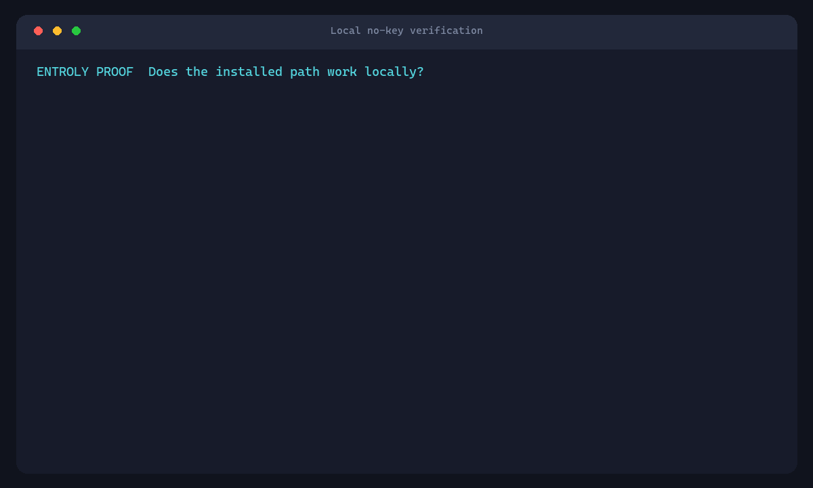
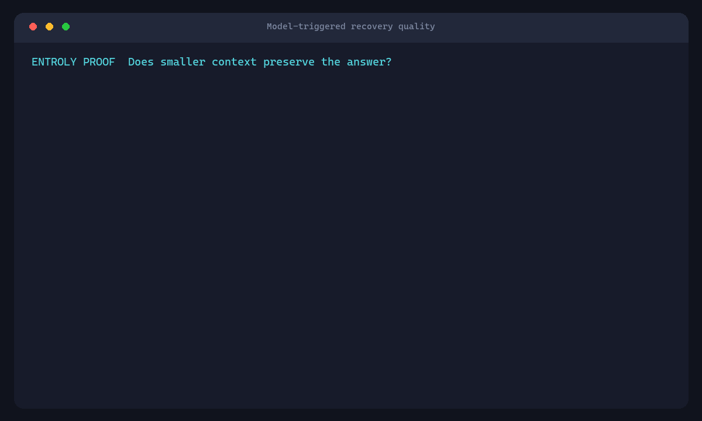
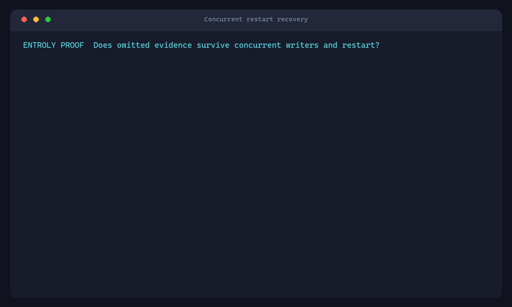

<p align="center">
  
</p>

<h1 align="center">Entroly — Drop-In Context Assurance to Lower AI Operational Cost</h1>

<p align="center"><b>Reduce unnecessary context without losing control of critical evidence.</b><br>
Select the highest-value evidence first, compress it, keep originals recoverable, and emit a receipt — without rewriting your codebase or agent architecture.</p>

<p align="center">
  <sub>Entroly is a local-first Context OS: content-addressed evidence, recoverable compression, and auditable receipts. Works through proxy, MCP, plugin, wrapper, and SDK paths with Claude Code, Codex, OpenClaw, GitHub Copilot, Cursor, Aider, and OpenAI/Anthropic-compatible apps.</sub>
</p>

<p align="center">
  <a href="https://pypi.org/project/entroly/"></a>
  <a href="https://www.npmjs.com/package/entroly"></a>
  <a href="https://pypistats.org/packages/entroly"></a>
  <a href="https://www.npmjs.com/package/entroly"></a>
  <a href="LICENSE"></a>
  <a href="benchmarks/results/receipt_fragment_fidelity_default.json"></a>
  <a href="benchmarks/results/receipt_public_integrity.json"></a>
  <a href="https://github.com/juyterman1000/entroly"></a>
</p>

<p align="center"><sub>~72,000 combined PyPI + npm downloads.</sub></p>

<p align="center">
  <b><a href="#what-is-entroly-in-plain-english">What is it?</a> · <a href="#install">Install</a> · <a href="#quickstart--by-how-you-work">Quickstart</a> · <a href="#see-it-work-in-30-seconds">See it work</a> · <a href="#benchmarks">Benchmarks</a> · <a href="#common-questions">Questions</a></b>
</p>

---

## What is Entroly? (in plain English)

AI coding assistants have a memory limit. Hand one your whole codebase and it
gets slow, expensive, and distracted — like giving someone a 500-page manual
when they only needed page 47.

**Entroly finds page 47.**

It sits between your code and the AI, reads everything, and passes along only
the parts that matter for the question actually being asked. Three things make
that safe to do:

|  |  |
|---|---|
| 💰 **Your bill goes down** | Fewer words sent to the AI means a smaller invoice. How much depends on the job — see the [real numbers](#benchmarks) below. |
| 🔍 **Nothing is lost** | Whatever Entroly sets aside is kept and can be pulled back *exactly* as it was, character for character. |
| 🧾 **You can check its work** | Every decision comes with a receipt: what was kept, what was left out, and why. |

**Do I have to change my code?** No. Entroly works with the tools you already
use — Claude Code, Cursor, Copilot and 30+ others — and runs in the background.

**Do I need to pay for anything to try it?** No. The two commands in the
[Install](#install) section below run entirely on your own machine, with no API
key, and show you real numbers on your own project before you connect anything
paid.

---

## Install

> **Not sure which one?** Pick **Python**. It's the complete version and what
> most people use. The others are alternate ways to run the same engine.

| Platform | Install | What you get |
|---|---|---|
| 🐍 **Python** (pip) — *recommended* | `pip install -U entroly` | Everything: the command-line tool, the server your AI editor talks to, and the code library |
| 📦 **Node / npm** | `npm install -g entroly` | The same engine, if you'd rather not install Python |
| 🦀 **Rust** (source build) | `cd entroly-core && cargo build --release --bin entroly-rs --features proxy` | One self-contained program, no Python or Node needed |
| 🍺 **Homebrew** | `brew install juyterman1000/entroly/entroly` | The command-line tool on macOS/Linux |
| 🐳 **Docker** | `docker pull ghcr.io/juyterman1000/entroly:latest` | Runs in a container, nothing installed on your machine |

**Now check that it worked — free, offline, no API key:**

```bash
cd /your/repo
entroly verify-claims   # checks the install really does what this page claims
entroly simulate        # shows how much smaller YOUR project would get
```

<sub>Both run locally. Neither one calls an AI or costs anything.</sub>

Extras (`entroly[proxy]`, `entroly[native]`, `entroly[full]`), the standalone
Rust binary, and uninstall steps: [Engine & install options](docs/DETAILS.md#engine--install-options).

---

## Quickstart — by how you work

> **Just want it working?** `pip install -U entroly && entroly go` — that's the
> whole thing. It finds your editor, sets itself up, and shows you a
> before/after dashboard. The rest of this table is for specific setups.

| Your situation | Do this | What it gets you |
|---|---|---|
| 🟢 **"I just want it on."** *(pip / Python user)* | `pip install -U entroly && entroly go` | Auto-detects your editor, wraps your agent, opens a dashboard showing tokens before and after |
| **"I use Node, not Python."** *(npm user)* | `npm install -g entroly && entroly init` | Same engine, nothing Python required |
| **"I want one binary, no runtime."** *(Rust user)* | `cargo build --release --bin entroly-rs --features proxy` (from `entroly-core/`) | A single native program with no dependencies |
| **"I use Claude Code / Cursor / Windsurf / VS Code."** *(MCP user)* | `entroly attach create --client claude --project . --ttl 4h --install` (or `entroly init` for Cursor/VS Code) | Your editor gets compression, receipts, and recovery as built-in tools — access expires on its own, and you change zero code |
| **"I'm building my own app in Python."** *(SDK user)* | `from entroly import compress, compress_messages, optimize` | Call it straight from your code, anywhere you assemble a prompt |
| **"I have an API key and my own app."** *(proxy user)* | `entroly proxy` → point `ANTHROPIC_BASE_URL` / `OPENAI_BASE_URL` / `GOOGLE_GEMINI_BASE_URL` at `localhost:9377` | Every request gets optimized on the way past — no code changes on your side |

**Why bother:** less unnecessary context reaches the model (lower bill, less
distraction for the model), nothing is silently lost (every drop is
recoverable and receipted), and you can prove it — `entroly verify-claims`
and `entroly simulate` show real numbers on your own repo before you connect
a paid key.

```python
from entroly import compress, compress_messages, optimize

compressed = compress(api_response, budget=2000)          # query-agnostic
messages   = compress_messages(messages, budget=30000)    # whole conversation
context    = optimize(fragments, budget=8000, query="fix the login bug")  # task-conditioned
```

```bash
entroly compress response.json --out small.json    # compress one file, get a receipt
entroly recover sha256:0b957c79... --out restored.json   # get the exact original back
```

Full setup paths for every agent, IDE, and CI use case: [Get started in depth](docs/first-run-trust.md) · [Command reference](docs/DETAILS.md#command-reference).

---

## See it work in 30 seconds

Not mocked recordings — each video is rendered from a checked-in command that
verifies its source artifact before printing a number.

<p align="center">
  <a href="docs/assets/proof_local.mp4"></a>
</p>

<p align="center"><code>entroly verify-claims</code> — import, compression, receipts, WITNESS checks, recovery, proxy routing, replay. No API key.</p>

<p align="center">
  <a href="docs/assets/proof_model_recovery.mp4"></a>
</p>

<p align="center">On a frozen 24-case holdout, Entroly answered <b>24/24</b>; a published baseline answered <b>18/24</b> at roughly 1.5x the effective context. <code>python scripts/readme_proof.py model-recovery</code></p>

<p align="center">
  <a href="docs/assets/proof_restart_recovery.mp4"></a>
</p>

<p align="center">Omitted evidence recovered <b>byte-exact</b> after a process restart, 66/66 payloads. <code>python scripts/readme_proof.py restart-recovery</code></p>

Full protocols, sample sizes, and every caveat: **[docs/BENCHMARKS.md](docs/BENCHMARKS.md)**.

---

## Benchmarks

The question that matters: **if you send less, does the AI start getting things
wrong?** These are standard public tests, run with and without Entroly.

*How to read this:* **Retention** is how well the AI still answered — 100% means
it did just as well on far less text. **Token savings** is how much less was
sent (and therefore paid for). Measured with `gpt-4o-mini`; intervals are Wilson 95% CIs.

| Benchmark | Baseline | With Entroly | Retention | Token savings |
|---|---|---|---|---|
| NeedleInAHaystack | 100% | 100% | **100%** | **99.5%** |
| LongBench (HotpotQA) | 64% | 66% | **103%** | **85.3%** |
| Berkeley Function Calling | 100% | 100% | **100%** | **79.3%** |
| SQuAD 2.0 | 80% | 72% | **90%** | **43.8%** |
| GSM8K | 85% | 85% | **100%** | pass-through* |

<sub>*pass-through: context already fit the budget, left unchanged. n=20–50 per row. Reproduce: `python benchmarks/run_readme_benchmarks.py` (needs `OPENAI_API_KEY`).</sub>

**Being straight with you:** look at the SQuAD 2.0 row — accuracy went *down*
(80% → 72%). Compression is a trade, not magic, and it doesn't win everywhere.
That's why `entroly simulate` exists: run it on your own project and see your
own numbers before you commit to anything.

Hallucination detection (WITNESS, local, no API): **84.92%** accuracy / **0.7976 AUROC** on 20,000 [HaluEval-QA](https://github.com/RUCAIBox/HaluEval) decisions — within the reported uncertainty of `gpt-4o-mini` as an API judge on the same shared sample.

Frozen evidence-selection benchmark (opt-in PRISM-R research prototype, not the default compressor): a disagreement guard kept the answer-bearing passage in 298 of 300 cases while selecting an average of 1.02 of 16 passages (paired exact McNemar p=0.21875 vs. BM25 alone) — this experiment measures retrieval of the known-answer passage, not generated-answer quality. Full protocol: [PRISM-R neural evidence frontier](docs/benchmarks/neural-evidence-frontier.md).

Recovery, latency, and head-to-head frontier results — [context-cap retention](docs/BENCHMARKS.md#matched-token-cap-active-context-quality-frontier-1059-source-candidate), [compression gauntlet](docs/BENCHMARKS.md#same-input-compression-gauntlet), [cross-process recovery](docs/BENCHMARKS.md#cross-process-recovery-holdout), [model-triggered recovery](docs/benchmarks/model-triggered-recovery.md) — are in **[docs/BENCHMARKS.md](docs/BENCHMARKS.md)** with every raw artifact linked, including the [PRISM-R neural evidence frontier](docs/benchmarks/neural-evidence-frontier.md). None of these numbers are a universal or production-savings guarantee for your workload — reproduce them on your own repo with `entroly simulate` and `entroly value`.

---

## Features

- **Picks first, shrinks second** — it works out which files actually answer your question, *then* compresses them. Most tools just squeeze whatever text was already handed to them. <sub>Ranks your repo or document set with BM25 + entropy + dependency graph, then fills a token budget.</sub>
- **Gives you the original back, exactly** — anything left out can be restored character-for-character, and it's checked against a fingerprint so you know it wasn't altered. <sub>Digest- and length-verified handle to the original bytes; `entroly compress` / `entroly recover` prove it across a process boundary.</sub>
- **Shows its work** — a receipt for every decision: what was kept, what was left out and why, and what risk remains. <sub>Includes dependency links and source-span digests.</sub>
- **Fact-checks answers** — compares what the AI said against the evidence it was given, on your machine, without paying for a second AI call. <sub>WITNESS verifier, fully local.</sub>
- **Doesn't wreck your caching** — keeps the unchanging parts of your prompt stable so your provider's discount for repeated text still applies. <sub>Stable system/history bytes stay ahead of changing context.</sub>
- **Rescues sessions before they crash** — when a conversation grows too big, it trims recoverable output instead of letting the provider reject the request mid-task. <sub>Proxy-side compaction of tool output.</sub>
- **Lets agents choose the evidence fidelity** — `smart_read` supports exact full text, inclusive line ranges, whole-file diffs, budget-aware automatic reads, and lightweight multi-language structure outlines. Exact same-session re-reads collapse to an opaque content handle; `fresh=true` restores the rendered text. <sub>Source-, contract-, and output-digest guarded; structure fails open to full source when no useful outline is available.</sub>
- **Builds verified code context** — an optional local-first parser pack maps 27+ language grammars and emits exact declaration and recognized call-site spans. Budgeted maps, typed graph queries, architecture layers/communities/routes, HTTP endpoint mounts, portable graph snapshots, program flow, structural health, and two-phase rename, safe-delete, or Python module-move plans carry source hashes, ambiguity, omissions, and tamper-evident receipts. <sub>An operator-configured LSP can add bounded workspace references; Entroly verifies returned ranges but cannot enforce the external server's network behavior. Community and hotspot scores are disclosed heuristics, and refactors do not claim compiler-complete references; [design and limitations](docs/verified-code-context.md).</sub>
- **Understands command outcomes** — shell profiles preserve invocations, failures, and terminal summaries under tight budgets. <sub>Unknown commands retain deterministic fallbacks and exact recovery.</sub>
- **Fits existing Python gateways** — metadata-safe LangChain messages/documents, a LiteLLM pre-call hook, and bounded ASGI middleware reuse the same budgeted message compressor without changing tool contracts. <sub>Framework dependencies remain optional.</sub>
- **Can route cheap work to cheap models** — optional, and when it isn't confident it always picks the stronger model rather than gambling. <sub>Fail-closed routing; local ranking adapts from recorded outcomes, no embeddings API.</sub>

Runs as a **CLI**, **Python/TypeScript SDK**, **MCP server**, **HTTP proxy**, or **library import**. Full surface map — every command, every SDK function, every MCP tool: **[docs/product-surface.md](docs/product-surface.md)**. Architecture and Rust internals: **[docs/DETAILS.md](docs/DETAILS.md)**.

---

## Works with your stack

| Agent / platform | Path | Status |
|---|---|---|
| Claude Code | Scoped MCP attachment; API-key proxy | Native |
| Codex CLI | Scoped MCP attachment; API-key proxy | Native |
| OpenClaw | Context-engine plugin + scoped MCP | Native |
| Cursor / Windsurf / VS Code | Automatic MCP config | Automatic |
| GitHub Copilot CLI | MCP (subscription) / proxy (BYOK) | Supported |
| Cortex Code | SDK/library boundary only | Not validated as a wrap target |
| Aider, OpenCode, and 30+ more | Session-scoped OpenAI-compatible proxy | One command |

Status describes integration depth, not a savings guarantee — provider-observed savings require requests to actually traverse an Entroly proxy route. Entroly does not claim interception of GitHub-hosted subscription inference on Copilot's native path. Full compatibility matrix with every client and its authentication boundary: **[docs/agent-compatibility.md](docs/agent-compatibility.md)**.

---

## When to use it · when to skip it

**Great fit:** large repos where the agent only sees a few files at a time · chatty multi-turn agents (cache alignment compounds savings) · anywhere you want answers checked against evidence · cutting a real, growing AI bill.

**Skip it:** tiny repos or short prompts that already fit the budget (Entroly passes them through unchanged) · judgment-heavy tasks where you always want the full flagship model.

---

## More commands

Also available: `entroly wrap`, `entroly unwrap`, `entroly serve`,
`entroly daemon`, `entroly dashboard`, `entroly demo`, `entroly capabilities`,
`entroly ingest`, `entroly select`, `entroly receipt`, `entroly explain`,
`entroly context-commit`, `entroly proof`, `entroly benchmark`,
`entroly cache`, `entroly ravs`, `entroly perf`, `entroly batch`. Full
description of every command: [command reference](docs/DETAILS.md#command-reference).

---

## Common questions

<details>
<summary><b>Will this change my code or my files?</b></summary>
<br>

No. Entroly reads your files and decides what to send to the AI. It never edits,
moves, or deletes anything in your project.
</details>

<details>
<summary><b>Does my code get uploaded anywhere?</b></summary>
<br>

No. All the selecting, compressing, and checking happens on your own machine.
Entroly makes no outbound calls of its own — the only thing that leaves your
computer is the request you were already sending to your AI provider, just
smaller. There are no analytics on by default.
</details>

<details>
<summary><b>What if it leaves out something important?</b></summary>
<br>

Nothing is thrown away. Anything left out is stored and can be restored exactly
as it was — `entroly recover` gives you back the original, character for
character, and it's verified against a fingerprint so you know it wasn't
altered. The receipt also tells you what was left out and why, so you're never
guessing.
</details>

<details>
<summary><b>How much money will this actually save me?</b></summary>
<br>

Honestly: it depends on your project, and anyone who gives you a single number
without seeing your work is guessing. Run `entroly simulate` in your project —
it's free, needs no API key, and estimates the reduction on *your* files. If
your prompts are already small, Entroly passes them through untouched and saves
you nothing, which it will tell you.
</details>

<details>
<summary><b>I'm not a developer. Can I use this?</b></summary>
<br>

If you use an AI coding tool like Claude Code or Cursor, yes. Install it
(`pip install -U entroly`), then run `entroly go` — it finds your editor,
configures itself, and opens a dashboard. You don't need to write any code or
understand what's under the hood. If you don't use an AI coding assistant,
Entroly isn't for you.
</details>

<details>
<summary><b>Something broke / I'm stuck.</b></summary>
<br>

Run `entroly doctor` — it checks your setup and reports what's wrong. If that
doesn't sort it, [open an issue](https://github.com/juyterman1000/entroly/issues)
or ask in [Discussions](https://github.com/juyterman1000/entroly/discussions).
</details>

<details>
<summary><b>What do all these words mean? (jargon decoder)</b></summary>
<br>

| Word | What it actually means |
|---|---|
| **Token** | Roughly ¾ of a word. AI providers charge per token, so "fewer tokens" = smaller bill. |
| **Context** | Everything you send the AI along with your question — your code, past messages, documents. |
| **Context window** | The AI's memory limit. Go over it and things get dropped or rejected. |
| **CLI** | Command-line tool — the thing you type `entroly ...` into. |
| **SDK / library** | Code you can call from your own program, instead of typing commands. |
| **MCP** | A standard way for AI editors (Claude Code, Cursor) to plug into outside tools. Entroly speaks it, so those editors can use it directly. |
| **Proxy** | A middleman that sits on the path between your app and the AI, so it can shrink requests without you changing any code. |
| **Receipt** | Entroly's written record of what it kept, what it left out, and why. |
| **Compression** | Sending less text while keeping the meaning. |
| **Recovery** | Getting the left-out original back, exactly as it was. |

</details>

---

## Docs & community

- **[Full benchmark evidence](docs/BENCHMARKS.md)** — every number, protocol, artifact, and caveat, including [Context Commit conformance](benchmarks/results/context_commit_conformance.json) (128/128 deterministic replay, 576/576 exact recovery, 768/768 tamper detection).
- **[Product surface map](docs/product-surface.md)** — CLI, SDK, MCP, proxy, npm/WASM, verification, memory, security.
- **[Architecture & full spec](docs/DETAILS.md)** — Rust modules, 3-resolution compression, provenance, command reference.
- **[Agent compatibility](docs/agent-compatibility.md)** — every supported client and its exact authentication boundary.
- **[First-run trust guide](docs/first-run-trust.md)** — exactly what to run before wiring a paid model key.
- **[For teams](docs/for-teams.md)** — ROI, security, deployment one-pager.
- **[Limitations](docs/limitations.md)** — where Entroly helps, where it passes through, what it doesn't guarantee.
- **[Public evidence policy](docs/public-evidence.md)** — claim tiers and package links.
- **[Context Commits](docs/context-commits.md)** · **[Context Receipts](docs/DETAILS.md#context-receipts)** · **[Proof-guided recovery](docs/proof-guided-context-fixed-point.md)** — portable, recoverable, verifiable context artifacts.
- **[Cookbook](cookbook/README.md)** — copy-paste recipes.
- **[Discord](https://juyterman1000.github.io/entroly/docs/discord.html)** · **[Discussions](https://github.com/juyterman1000/entroly/discussions)** · **[Issues](https://github.com/juyterman1000/entroly/issues)**

> Compressing a *bad* selection is still a bad selection. Entroly ranks first, then compresses — so the model gets structure, not just fewer tokens.

<p align="center"><sub>Apache-2.0 · local-first · no outbound analytics by default</sub></p>
<p align="center"><code>pip install entroly && entroly go</code></p>

<!-- mcp-name: io.github.juyterman1000/entroly -->
