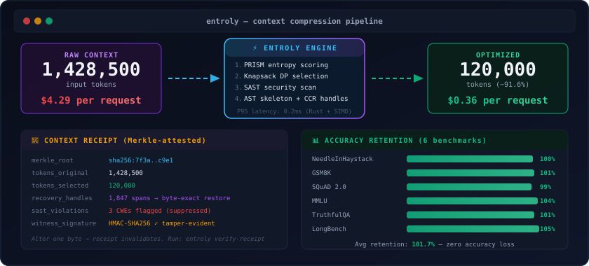

<p align="center">
  
</p>

<h1 align="center">Entroly — Select AI context with auditable recovery.</h1>

<p align="center"><b>Receipt-backed selection records: what was kept, what was omitted, and the handle that recovers the exact original bytes.</b><br>
Compression you can undo, on your own repository, in one command — without replacing your model or agent architecture.</p>

<p align="center">
  
</p>

<p align="center"><code>code --install-extension entroly.entroly-vscode</code> &nbsp;·&nbsp; <code>pip install -U entroly && entroly go</code> &nbsp;·&nbsp; <code>npx entroly</code></p>
<p align="center">
  <sub>Entroly is an open-source, local-first AI token-efficiency and Context Assurance layer: budgeted evidence selection, recoverable context compression, content-addressed evidence recovery, and auditable receipts. Works through VS Code, Claude Code, Cursor, Codex, OpenClaw, GitHub Copilot, Aider, and OpenAI/Anthropic-compatible apps.</sub>
</p>
<p align="center">
  <a href="https://marketplace.visualstudio.com/items?itemName=entroly.entroly-vscode"></a>
  <a href="https://pypi.org/project/entroly/"></a>
  <a href="https://www.npmjs.com/package/entroly"></a>
  <a href="https://pypistats.org/packages/entroly"></a>
  <a href="https://www.npmjs.com/package/entroly"></a>
  <a href="LICENSE"></a>
  <a href="benchmarks/results/receipt_fragment_fidelity_default.json"></a>
  <a href="benchmarks/results/receipt_public_integrity.json"></a>
  <a href="https://github.com/juyterman1000/entroly"></a>
  <a href="https://github.com/juyterman1000/entroly/actions"></a>
  <a href="https://github.com/juyterman1000/entroly/issues?q=is%3Aissue+is%3Aopen+label%3A%22good+first+issue%22"></a>
  <a href="https://lobehub.com/mcp/juyterman1000-entroly"></a>
</p>

<p align="center">
  <b>English · <a href="docs/i18n/README.zh.md">简体中文</a> · <a href="docs/i18n/README.zh-TW.md">繁體中文</a> · <a href="docs/i18n/README.ja.md">日本語</a> · <a href="docs/i18n/README.ko.md">한국어</a> · <a href="docs/i18n/README.es.md">Español</a> · <a href="docs/i18n/README.hi.md">हिन्दी</a> · <a href="docs/i18n/README.fr.md">Français</a> · <a href="docs/i18n/README.de.md">Deutsch</a> · <a href="docs/i18n/README.pt-BR.md">Português</a> · <a href="docs/i18n/README.it.md">Italiano</a> · <a href="docs/i18n/README.tr.md">Türkçe</a> · <a href="docs/i18n/README.vi.md">Tiếng Việt</a> · <a href="docs/i18n/README.id.md">Bahasa Indonesia</a> · <a href="docs/i18n/README.pl.md">Polski</a> · <a href="docs/i18n/README.nl.md">Nederlands</a> · <a href="docs/i18n/README.th.md">ไทย</a> · <a href="docs/i18n/README.sv.md">Svenska</a> · <a href="docs/i18n/README.cs.md">Čeština</a> · <a href="docs/i18n/README.tl.md">Tagalog</a> · <a href="docs/i18n/README.ro.md">Română</a></b>
</p>

## Accuracy Retention

> **Historical maintainer-reported experiment, not a quality guarantee.** The
> table below reports one 50K-token-budget run. Overlapping confidence intervals
> do not establish equivalence or rule out degradation. These results have not
> been independently reproduced here.

<sub>Model: <code>gpt-4o-mini</code> · Budget: 50K tokens · Wilson 95% CI · Reproduce: <code>python -m bench.accuracy --benchmark all</code></sub>

| Benchmark | n | Baseline (95% CI) | Entroly (95% CI) | Retention | Benchmark Delta |
|---|---|---|---|---|---|
| **NeedleInAHaystack** | 20 | 100.0% [83.9–100%] | 100.0% [83.9–100%] | **100.0%** | Baseline |
| **GSM8K** | 100 | 85.0% [76.7–90.7%] | 86.0% [77.9–91.5%] | **101.2%** | +1.0% |
| **SQuAD 2.0** | 100 | 84.0% [75.6–89.9%] | 83.0% [74.5–89.1%] | **98.8%** | -1.0% |
| **MMLU** (4-way MCQ) | 100 | 82.0% [73.3–88.3%] | 85.0% [76.7–90.7%] | **103.7%** | +3.0% |
| **TruthfulQA** (MC1) | 100 | 72.0% [62.5–79.9%] | 73.0% [63.6–80.7%] | **101.4%** | +1.0% |
| **LongBench** (HotpotQA) | 100 | 57.0% [47.2–66.3%] | 59.8% [49.8–69.0%] | **104.9%** | +2.8% |

<sub>The reported SQuAD score fell from 84% to 83%. Retention ratios above 100%
can reflect sampling or model variability. The displayed intervals are historical
reported values, not a validated paired comparison; Wilson intervals require
binary outcomes and do not justify uncertainty for averaged partial-credit scores.
Establishing non-inferiority needs a predefined tolerance, paired per-task outcomes,
appropriate uncertainty estimates, and adequate sample size. These results cannot
be extrapolated to more aggressive compression or other models.</sub>

### Context Selection Quality

<sub>19-fragment synthetic corpus · 300-token budget · 3 fixture queries · Reproduce: <code>entroly benchmark</code></sub>

| Metric | RAW (Naive FIFO) | TOP-K (local baseline) | **ENTROLY (Knapsack)** |
|---|---|---|---|
| Avg fragments selected | 6.0 | 6.0 | **8.7** |
| Avg module coverage | 3.0 | 3.7 | **8.7** |
| Total SAST catches | 0 | 0 | **3** |

<sub>Entroly sees <b>8.7 modules</b> where TOP-K sees 3.7 — it includes auth, payments, AND rate limiting. TOP-K misses the rate limiter. <a href="BENCHMARKS.md">Full methodology, CIs, and reproduce commands →</a></sub>

---

## Research

Entroly includes the following research-oriented implementations. A module's
presence does not establish production reliability, mathematical novelty, or
independent validation; consult its implementation and evaluation limitations.

| Algorithm | What it does | Implementation |
|---|---|---|
| **BIPT** | Byte-level hallucination detection via Kolmogorov-inspired provenance tracing | [`provenance_tracer.py`](entroly/verifiers/provenance_tracer.py) |
| **NKBE** | Nash-KKT multi-agent token budget equilibrium | [`nkbe.rs`](entroly-core/src/nkbe.rs) |
| **Causal Context Graph** | Intervention-aware fragment feedback learning | [`causal.rs`](entroly-core/src/causal.rs) |
| **Cognitive Bus** | ISA event routing with KL-divergence priority | [`cognitive_bus.rs`](entroly-core/src/cognitive_bus.rs) |
| **Resonance Matrix** | Supermodular pairwise fragment value learning | [`resonance.rs`](entroly-core/src/resonance.rs) |
| **System 1 <> 2** | Dual-process verified-belief bridge (proxy <> vault) | [`coupling.py`](entroly/coupling.py) |

> [Read the full research documentation](docs/RESEARCH.md) · [Cite Entroly](CITATION.cff)
---

<p align="center">
  <b><a href="#what-is-entroly-in-plain-english">What is it?</a> · <a href="#install">Install</a> · <a href="#quickstart--by-how-you-work">Quickstart</a> · <a href="#benchmarks">Benchmarks</a> · <a href="#common-questions">Questions</a></b>
</p>

---

## Integration hub

Use Entroly at the SDK, framework, proxy, MCP, plugin or agent boundary. A
listed name is not automatically a claim that hosted subscription inference is
intercepted; provider-bound savings exist only when the request traverses an
Entroly-controlled route.

| Direct, tested paths | Guided or bounded paths |
|---|---|
| [Vercel AI SDK middleware](docs/integration-hub.md#vercel-ai-sdk) · [OpenAI SDK](docs/integration-hub.md#openai-sdk) · [Anthropic SDK](docs/integration-hub.md#anthropic-sdk) | [Agno](docs/integration-hub.md#agno) · [Strands Agents](docs/integration-hub.md#strands-agents) · [CrewAI](docs/integration-hub.md#crewai) · [AutoGen](docs/integration-hub.md#autogen) |
| [LangChain](docs/integration-hub.md#langchain) · [LiteLLM](docs/integration-hub.md#litellm) · [MCP](docs/integration-hub.md#mcp) | [Claude Code on Vertex AI](docs/integration-hub.md#claude-code-on-vertex-ai) · [Claude Code on Azure AI Foundry](docs/integration-hub.md#claude-code-on-azure-ai-foundry) |
| [OpenClaw](docs/integration-hub.md#openclaw) · [OpenCode](docs/integration-hub.md#opencode) | [Claude Code in VS Code](docs/integration-hub.md#claude-code-in-vs-code) · [VS Code Copilot](docs/integration-hub.md#vs-code-copilot) · [Grok](docs/integration-hub.md#grok) |

**[Open the complete verified integration and operations hub →](docs/integration-hub.md)**

---
## What is Entroly? (in plain English)

AI coding assistants have a memory limit. Hand one your whole codebase and it
gets slow, expensive, and distracted — like giving someone a 500-page manual
when they only needed page 47.

**Entroly finds page 47.**

It sits between your code and the AI, reads everything, and passes along only
the parts selected for the question. Three properties to evaluate on your task:
|  |  |
|---|---|
| 💰 **Your bill goes down** | Fewer words sent to the AI means a smaller invoice. How much depends on the job — see the [real numbers](#benchmarks) below. |
| 🔍 **Recoverable originals** | Receipt-backed recovery retains source material locally. Exact recovery requires the referenced store and source bytes to remain available; it does not guarantee answer quality. |
| 🧾 **You can check its work** | Every decision comes with a receipt: what was kept, what was left out, and why. |
**Do I have to change my code?** No. On hosts with a verified prompt hook,
Entroly runs before the model plans. MCP-only integrations remain callable
tools that an agent may skip; API traffic is intercepted only when it is routed
through the Entroly proxy. Check `entroly activation status --json` instead of
assuming an installed integration is active.

**Do I need to pay for anything to try it?** No. The two commands in the
[Install](#install) section below run on your own machine, with no API key, and
show you real numbers on your own project before you connect anything paid.
(Missing native-engine support is reported without downloading packages — see
the note under [Install](#install).)

---
## Install

> **Not sure which one?** Pick **Python**. It's the complete version and what
> most people use. The others are alternate ways to run the same engine.
| Platform | Install | What you get |
|---|---|---|
| 🐍 **Python** (pip) — *recommended* | `pip install -U entroly` | Everything: the command-line tool, the server your AI editor talks to, and the code library |
| 📦 **Node / npm** | `npm install -g entroly` | The same engine, nothing Python required |
| 🦀 **Rust** (source build) | `cd entroly-core && cargo build --release --bin entroly-rs --features proxy` | One self-contained program, no Python or Node needed |
| 🍺 **Homebrew** | `brew install juyterman1000/entroly/entroly` | The command-line tool on macOS/Linux |
| 🐳 **Docker** | `docker pull ghcr.io/juyterman1000/entroly:latest` | Runs in a container, nothing installed on your machine |

**Prefer a package runner instead of a global install?** These commands use
the same published artifacts in an isolated tool cache:

```bash
# Node / WASM runtime
npx -y entroly@latest --help
pnpm dlx entroly@latest --help
bunx entroly@latest --help

# Complete Python runtime
uvx --from entroly entroly --help
pipx run --spec entroly entroly --help
```

The Node commands provide the local WASM CLI. The Python commands provide the
complete CLI, SDK, MCP, proxy, verification, and native-engine path described
above. Entroly's release workflow smoke-tests all five runners against the
exact version before a release is considered complete.

**Now check that it worked — free, no API key:**

```bash
cd /your/repo
entroly verify-claims
entroly simulate
```

<sub>Both run locally. Neither one calls an AI or costs anything.</sub>

<sub>Runtime package repair is **off by default**. If the native engine is missing,
query-conditioned selection is unavailable and reduction figures are labelled
unearned. Install it explicitly with `python -m pip install -U entroly-core`, call
`entroly.repair()` from Python, or set `ENTROLY_ENABLE_SELF_HEAL=1` to permit
startup repair. This downloads through the configured package index (normally
PyPI). `ENTROLY_NO_SELF_HEAL=1` and `ENTROLY_AIR_GAP=1` override repair consent.
See [Privacy](PRIVACY.md) and [recovery-data security](docs/recovery-data-security.md).</sub>

Extras (`entroly[proxy]`, `entroly[native]`, `entroly[full]`), the standalone
Rust binary, and uninstall steps: [Engine & install options](docs/DETAILS.md#engine--install-options).

Contributing from source? Follow the reproducible
[development setup](CONTRIBUTING.md#development-setup). Local installation and
the normal test suite need no API key; [`.env.example`](.env.example) documents
only optional workspace, offline, provider, and proxy settings.

---
## Quickstart — by how you work

> **Just want it working?** `pip install -U entroly && entroly go` — that's the
> whole thing. It finds your editor, sets itself up, and shows you a
> before/after dashboard. The rest of this table is for specific setups.
| Your situation | Do this | What it gets you |
|---|---|---|
| 🟢 **"I just want it on."** *(pip / Python user)* | `pip install -U entroly && entroly go` | Auto-detects your editor, wraps your agent, opens a dashboard showing tokens before and after |
| **"I use Node, not Python."** *(npm user)* | `npm install -g entroly && entroly init` | Same engine, nothing Python required |
| **"I want one binary, no runtime."** *(Rust user)* | `cargo build --release --bin entroly-rs --features proxy` (from `entroly-core/`) | A single native program with no dependencies |
| **"I use Claude Code, Codex, Gemini CLI, or VS Code agent plugins."** *(plugin user)* | Install the Entroly plugin/extension for that host, submit one prompt, then run `entroly activation status --json` | A trusted prompt hook performs bounded local selection before planning; a receipt proves the hook ran |
| **"I use Cursor with third-party configs enabled."** | `entroly activation install --host cursor --project .` | Merges a reversible Claude-compatible prompt hook; native Cursor MCP remains advisory |
| **"I use Kiro IDE 1.x or CLI 3.x."** | `entroly activation install --host kiro --project .` | Installs a reversible project `PromptSubmit` hook whose stdout is added to agent context |
| **"I use another MCP host."** | `entroly attach create --client claude --project . --ttl 4h --install` or the client-specific command in the compatibility matrix | Scoped Entroly tools and receipts; the model can still skip MCP unless the host has a verified lifecycle hook |
| **"I'm building my own app in Python."** *(SDK user)* | `from entroly import compress, compress_messages, optimize` | Call it straight from your code, anywhere you assemble a prompt |

Cursor MCP users can also use this one-click install link (no marketplace
account required): [Add Entroly to Cursor](cursor://anysphere.cursor-deeplink/mcp/install?name=entroly&config=eyJjb21tYW5kIjoibnB4IiwiYXJncyI6WyIteSIsImVudHJvbHktbWNwQDEuMC44NCIsInNlcnZlIl0sImVudiI6eyJFTlRST0xZX05PX0RPQ0tFUiI6IjEiLCJFTlRST0xZX01DUF9QQVNTSVZFIjoiMSIsIkVOVFJPTFlfTUNQX1BST0ZJTEUiOiJwdWJsaWMiLCJFTlRST0xZX01BWF9GSUxFUyI6IjIwMCJ9fQ).
| **"I have an API key and my own app."** *(proxy user)* | `entroly proxy` → point `ANTHROPIC_BASE_URL` / `OPENAI_BASE_URL` / `GOOGLE_GEMINI_BASE_URL` at `localhost:9377` | Every request gets optimized on the way past — no code changes on your side |

<sub>**Runaway-session rescue — automatic on the proxy, callable everywhere else.**
When a long agent session approaches the provider's context limit, bulky tool
output is compacted in flight: no manual `/compact`, the prompt prefix stays
byte-stable so your warm provider cache survives, and every omitted span is
recoverable. The proxy does it for you because it sees the outbound request.
Anywhere else — pip, SDK, a provider-SDK wrapper, or an MCP host that passes its
transcript — hand the conversation over and get the same policy:
`from entroly import rescue_session`. `entroly capabilities` reports which
protections apply to how you are running. See
[session rescue](docs/session-rescue.md).</sub>

**Why bother:** less unnecessary context reaches the model (lower bill, less
distraction for the model), nothing is silently lost (every drop is
recoverable and receipted), and you can prove it — `entroly verify-claims`
and `entroly simulate` show real numbers on your own repo before you connect
a paid key.

```python
from entroly import compress, compress_messages, optimize
compressed = compress(api_response, budget=2000)
messages   = compress_messages(messages, budget=30000)
context    = optimize(fragments, budget=8000, query="fix the login bug")
```

```bash
entroly compress response.json --out small.json
entroly recover sha256:0b957c79... --out restored.json
```

Full setup paths for every agent, IDE, and CI use case: [Get started in depth](docs/first-run-trust.md) · [Command reference](docs/DETAILS.md#command-reference).

---
## See it work in 30 seconds

Not mocked recordings — each video is rendered from a checked-in command that
verifies its source artifact before printing a number.

<p align="center">
  <a href="docs/assets/proof_local.mp4"></a>
</p>
<p align="center"><code>entroly verify-claims</code> — import, compression, receipts, WITNESS checks, recovery, proxy routing, replay. No API key.</p>
<p align="center">
  <a href="docs/assets/proof_model_recovery.mp4"></a>
</p>
<p align="center">On a frozen 24-case holdout, Entroly answered <b>24/24</b>; a published baseline answered <b>18/24</b> at roughly 1.5x the effective context. <code>python scripts/readme_proof.py model-recovery</code></p>
<p align="center">
  <a href="docs/assets/proof_restart_recovery.mp4"></a>
</p>
<p align="center">Omitted evidence recovered <b>byte-exact</b> after a process restart, 66/66 payloads. <code>python scripts/readme_proof.py restart-recovery</code></p>

Full protocols, sample sizes, and every caveat: **[docs/BENCHMARKS.md](docs/BENCHMARKS.md)**.

---
## Benchmarks

The question that matters: **if you send less, does the AI start getting things
wrong?** These are standard public tests, run with and without Entroly.

*How to read this:* **Retention** is how well the AI still answered — 100% means
it did just as well on far less text. **Token savings** is how much less was
sent (and therefore paid for). Measured with `gpt-4o-mini`; intervals are Wilson 95% CIs.
| Benchmark | Baseline | With Entroly | Retention | Token savings |
|---|---|---|---|---|
| NeedleInAHaystack | 100% | 100% | **100%** | **99.5%** |
| LongBench (HotpotQA) | 64% | 66% | **103%** | **85.3%** |
| Berkeley Function Calling | 100% | 100% | **100%** | **79.3%** |
| SQuAD 2.0 | 80% | 72% | **90%** | **43.8%** |
| GSM8K | 85% | 85% | **100%** | pass-through* |
<sub>*pass-through: context already fit the budget, left unchanged. n=20–50 per row. Reproduce: `python benchmarks/run_readme_benchmarks.py` (needs `OPENAI_API_KEY`).</sub>

**Being straight with you:** look at the SQuAD 2.0 row — accuracy went *down*
(80% → 72%). Compression is a trade, not magic, and it doesn't win everywhere.
That's why `entroly simulate` exists: run it on your own project and see your
own numbers before you commit to anything.

Hallucination detection (WITNESS, local, no API): **84.92%** accuracy / **0.7976 AUROC** on 20,000 [HaluEval-QA](https://github.com/RUCAIBox/HaluEval) decisions — within the reported uncertainty of `gpt-4o-mini` as an API judge on the same shared sample.

Frozen evidence-selection benchmark (opt-in PRISM-R research prototype, not the default compressor): a disagreement guard kept the answer-bearing passage in 298 of 300 cases while selecting an average of 1.02 of 16 passages (paired exact McNemar p=0.21875 vs. BM25 alone) — this experiment measures retrieval of the known-answer passage, not generated-answer quality. Full protocol: [PRISM-R neural evidence frontier](docs/benchmarks/neural-evidence-frontier.md).

Recovery, latency, and head-to-head frontier results are in **[docs/BENCHMARKS.md](docs/BENCHMARKS.md)** with raw artifacts linked. None of these numbers are a universal or production-savings guarantee for your workload — reproduce them on your own repo with `entroly simulate` and `entroly value`.

---
## Features

- **Picks first, shrinks second** — it works out which files actually answer your question, *then* compresses them.
- **Gives you the original back, exactly** — anything left out can be restored character-for-character and checked against a fingerprint.
- **Shows its work** — a receipt for every decision: what was kept, what was left out and why, and what risk remains.
- **Fact-checks answers** — compares what the AI said against the evidence it was given, on your machine, without paying for a second AI call.
- **Doesn't wreck your caching** — keeps the unchanging parts of your prompt stable so your provider's discount for repeated text still applies.
- **Rescues sessions before they crash** — when a conversation grows too big, it trims recoverable output instead of letting the provider reject the request mid-task.
- **Can route cheap work to cheap models** — optional and fail-closed when uncertain.
- **Cross-agent shared memory** — Claude, Codex, Cursor, and Gemini can read and write the same compressed context store with automatic SimHash deduplication and agent provenance tracking.
- **Output token reduction** — effort-based routing classifies query complexity and steers model verbosity, reducing output tokens alongside input tokens.
- **Shell hook compression** — transparent CLI output compression for git, npm, cargo, docker, pytest, kubectl, and terraform. Preserves errors and warnings, strips progress bars and boilerplate.
- **Image compression** — 40-90% reduction on screenshots and diagrams for vision API calls, with optional OCR text extraction.
- **Failure mining** — `entroly learn --deep` mines session data for recurring failure patterns and writes corrections to CLAUDE.md, .cursorrules, and other agent configs.

Runs as a **CLI**, **Python/TypeScript SDK**, **MCP server**, **HTTP proxy**, or **library import**. Full surface map: **[docs/product-surface.md](docs/product-surface.md)**. Architecture and Rust internals: **[docs/DETAILS.md](docs/DETAILS.md)**.

---
## How Entroly compares

Entroly combines budgeted selection, source-span receipts, and optional
verification. These are distinct guarantees: a receipt records retained and
omitted material; recovery checks source integrity; WITNESS/EICV checks can still
produce false positives or false negatives. Solver objectives approximate useful
context and do not prove that the chosen context is sufficient for a task.

Compare tools on the same task set, version, model, token budget, and quality
criterion. The local TOP-K fixture does not measure any commercial product. We
do not provide an independently reproduced cross-product comparison here.

---
## Works with your stack

Install the public Codex plugin from the Entroly repository:

```console
codex plugin marketplace add juyterman1000/entroly --ref main
codex plugin add entroly@entroly-public
```

Restart Codex, review and trust the hook, then run `entroly activation status
--json` after a task. The marketplace installs the local Node/WASM runtime with
the plugin; the model does not have to remember to call an MCP tool before
Entroly runs. A receipt proves that the hook executed and selected local
context or made an explicit no-match decision. It does not prove token or cost
savings without a matched provider-bound baseline.

Install the same public repository as a Gemini CLI extension:

```console
gemini extensions install https://github.com/juyterman1000/entroly --ref main --consent
```

Restart Gemini CLI after installation. The repository root contains
`gemini-extension.json` and `GEMINI.md`, so the command works without navigating
into an integration subdirectory.

For VS Code or Kiro, download the `entroly-vscode-*.vsix` asset from the latest
[GitHub release](https://github.com/juyterman1000/entroly/releases/latest), then
install it with **Extensions: Install from VSIX** or `code --install-extension`.
The extension is self-contained and does not require an API key.

JetBrains AI Assistant users can add the same server globally at **Settings →
Tools → AI Assistant → Model Context Protocol (MCP)**:

```json
{
  "mcpServers": {
    "entroly": {
      "command": "npx",
      "args": ["-y", "entroly-mcp@1.0.84", "serve"],
      "env": {
        "ENTROLY_NO_DOCKER": "1",
        "ENTROLY_MCP_PASSIVE": "1",
        "ENTROLY_MCP_PROFILE": "public",
        "ENTROLY_MAX_FILES": "200"
      }
    }
  }
}
```

The repository also ships a free, open-source JetBrains plugin that guides this
setup from **Tools → Configure Entroly for AI Assistant**, checks the local
runtime on request, and keeps the evidence boundary visible. See
[`extensions/jetbrains`](extensions/jetbrains/README.md).

MCP marketplace and plugin manifests select the compact `public` profile so
agents see the core context, receipt, continuity, recovery, and verification
tools first. A direct `entroly serve` invocation remains backwards compatible
and exposes the full tool surface. You can choose either behavior explicitly
with `ENTROLY_MCP_PROFILE=public` or `ENTROLY_MCP_PROFILE=full`.

The MCP path is provider-neutral: the host can use OpenAI, Anthropic, Google,
Mistral, DeepSeek, Kimi, GLM, or a local model. There is no separate plugin
marketplace for each model provider; the host's MCP or extension contract is
the integration boundary.

| Agent / platform | Path | Status |
|---|---|---|
| Claude Code | Bundled `UserPromptSubmit` hook + scoped MCP | Deterministic after plugin enablement |
| Codex CLI / app | Bundled `UserPromptSubmit` hook + scoped MCP | Deterministic after hook trust |
| Gemini CLI | Bundled `BeforeAgent` hook + scoped MCP | Deterministic after extension enablement |
| OpenClaw | Context-engine plugin + scoped MCP | Native |
| Cursor | Claude-compatible project hook; MCP or proxy fallback | Deterministic only when third-party configs are enabled |
| Kiro IDE 1.x / CLI 3.x | Project `PromptSubmit` hook | Deterministic after project install |
| VS Code / Copilot agent mode | Agent-plugin hook where supported; MCP fallback | Host-version dependent |
| IntelliJ / JetBrains AI | MCP or supported custom endpoint | Advisory until a lifecycle hook is verified |
| GitHub Copilot CLI | MCP (subscription) / proxy (BYOK) | Supported |
| Cortex Code | SDK/library boundary only | Not validated as a wrap target |
| Aider, OpenCode, and 30+ more | Session-scoped OpenAI-compatible proxy | One command |

Hook enforcement belongs to the host, so it is independent of whether that
host runs an OpenAI, Anthropic, Gemini, Kimi, DeepSeek, Mistral, or GLM model.
Status describes integration depth, not a savings guarantee. Provider-observed
savings require requests to traverse an Entroly proxy route. Entroly does not claim interception of GitHub-hosted subscription inference on Copilot's native path. Full compatibility matrix: **[docs/agent-compatibility.md](docs/agent-compatibility.md)**.

Entroly carries verified metadata for current models from OpenAI, Anthropic, Google, Meta, and others. It auto-discovers local Ollama models. Model-specific details: **[docs/DETAILS.md](docs/DETAILS.md)**.

---
## When to use it · when to skip it

**Great fit:** large repos where the agent only sees a few files at a time · chatty multi-turn agents · anywhere you want answers checked against evidence · cutting a real, growing AI bill.

**Skip it:** tiny repos or short prompts that already fit the budget · judgment-heavy tasks where you always want the full flagship model.

---
## More commands

For evidence-led optimization rather than a synthetic savings estimate:

```bash
entroly learn --history --json
entroly shrink -- pytest -q
entroly trial --experiment checkout-fix --arm baseline -- codex exec "fix the checkout test"
entroly trial --experiment checkout-fix --arm optimized -- codex exec "fix the checkout test"
entroly trial --report checkout-fix
entroly browser https://example.com --query "billing settings"
entroly find docs/product-surface.md --query "exact source evidence" --json
entroly response set evidence --scope project
```

Trials run one explicitly selected arm at a time so a stateful or paid agent task is never repeated implicitly. Response contracts shape agent instructions; they do not truncate responses or count as measured savings. Browser and command reductions keep exact local recovery handles and pass through when their safety gates cannot be met.

For teams that need to say who an agent is and what it was allowed to do:

```bash
entroly govern status                          # identity, policies, audit chain
entroly govern policy check write --risk high  # evaluate one authorization
entroly govern audit verify                    # exit non-zero on a broken chain
```

Authorization is deny-by-default and every denial names the policy and the reason it gave. `audit verify` checks that recorded entries were not altered after the fact — it does not prove every action was recorded, and `govern status` reports the state of the local control plane only, not an attestation that each agent action passed through it. Identity tokens are unsigned unless `ENTROLY_IDENTITY_KEY` is set, and the credential is never printed.

Also available: `entroly wrap`, `entroly unwrap`, `entroly serve`, `entroly daemon`, `entroly dashboard`, `entroly demo`, `entroly capabilities`, `entroly ingest`, `entroly select`, `entroly receipt`, `entroly explain`, `entroly context-commit`, `entroly proof`, `entroly benchmark`, `entroly cache`, `entroly ravs`, `entroly perf`, `entroly batch`, `entroly usage`. Full description: [command reference](docs/DETAILS.md#command-reference).

---
## Common questions

<details>
<summary><b>Will this change my code or my files?</b></summary>
<br>
Context selection reads source files. Entroly also writes local indexes, receipts,
recovery data, and configuration when you run the corresponding setup or learning
commands. Review generated agent configuration before enabling it.
</details>

<details>
<summary><b>Does my code get uploaded anywhere?</b></summary>
<br>
Local selection and deterministic verification run on your machine. A configured
cloud provider receives the request, including selected code and prompts. Optional
WITNESS NLI can send evidence and claims to OpenAI. Product telemetry is off by
default but can upload allowlisted events after consent and endpoint configuration.
Package repair is also opt-in. Read [Privacy](PRIVACY.md) before enabling a network
feature and [recovery-data security](docs/recovery-data-security.md) before sharing
receipts or diagnostic bundles.
</details>

<details>
<summary><b>What if it leaves out something important?</b></summary>
<br>
Receipt-backed compression retains recovery material. `entroly recover` verifies
the original against its recorded digest and length. Missing, deleted, or corrupt
recovery data can prevent recovery. A receipt does not make an agent answer correct.
</details>

<details>
<summary><b>How much money will this actually save me?</b></summary>
<br>
Honestly: it depends on your project. Run `entroly simulate` in your project — it's free, needs no API key, and estimates the reduction on your own files. If your prompts are already small, Entroly passes them through untouched.
</details>

<details>
<summary><b>I'm not a developer. Can I use this?</b></summary>
<br>
If you use an AI coding tool like Claude Code or Cursor, yes. Install it (`pip install -U entroly`), then run `entroly go` — it finds your editor, configures itself, and opens a dashboard.
</details>

<details>
<summary><b>Something broke / I'm stuck.</b></summary>
<br>
Run `entroly doctor`. If that doesn't sort it, [open an issue](https://github.com/juyterman1000/entroly/issues) or ask in [Discussions](https://github.com/juyterman1000/entroly/discussions).
</details>

### Cross-agent shared memory

Content-addressed store with SimHash deduplication and BM25 search. Multiple agents (Claude Code, Codex, Cursor) write and query the same knowledge base with provenance tracking.

```python
from entroly import shared_memory_write, shared_memory_search
shared_memory_write("Auth uses JWT with RS256", agent_id="claude-code", tags=["auth"])
results = shared_memory_search("authentication tokens")  # finds it, from any agent
```

### Output token reduction

Three-layer pipeline: effort classification steers verbosity directives, `max_tokens` budgets cap generation, and post-generation distillation trims filler. A "yes/no" query gets 150 max tokens; a detailed architecture review gets 16,384.

### Shell hook compression

Command-specific patterns for git, npm, cargo, docker, pytest, kubectl, and terraform strip progress bars, deprecation warnings, and boilerplate while preserving errors and key results. Full output is recoverable via content-addressed handles.

```bash
entroly hook install     # adds transparent compression to your shell
entroly hook status      # shows which shells have the hook
```

### Failure mining

`entroly learn --deep` mines PRISM feedback, vault beliefs, evolution daemon, and checkpoint data for recurring failure patterns, then generates corrections for agent config files.

---

## Documentation

- **[Benchmarks](docs/BENCHMARKS.md)** — every number, protocol, artifact, and caveat.
- **[Context Commit conformance](benchmarks/results/context_commit_conformance.json)** — 128/128 deterministic replay, 576/576 exact recovery, 768/768 tamper detection.
- **[Architecture & internals](docs/DETAILS.md)** — Rust modules, compression pipeline, provenance, command reference.
- **[Agent compatibility](docs/agent-compatibility.md)** — every supported client and its authentication boundary.
- **[Limitations](docs/limitations.md)** — where Entroly helps, where it passes through, what it doesn't guarantee.
- **[Product surface map](docs/product-surface.md)** — CLI, SDK, MCP, proxy, verification, memory, security.
- **[First-run trust](docs/first-run-trust.md)** — what to run before wiring a paid model key.
- **[Public evidence policy](docs/public-evidence.md)** — claim tiers, benchmark scope, and package links.
- **[AI Cost Optimization Guide](docs/ai-cost-optimization.html)** — how context shaping reduces costs without model degradation.
- **[Model-Triggered Recovery](docs/benchmarks/model-triggered-recovery.md)** — automated omission recovery validation.
- **[Cookbook](docs/cookbook/README.md)** — copy-paste recipes.
- **[Discussions](https://github.com/juyterman1000/entroly/discussions)** · **[Issues](https://github.com/juyterman1000/entroly/issues)**

<p align="center"><sub>Apache-2.0 · local-first · no outbound analytics by default</sub></p>
<p align="center"><code>pip install entroly && entroly go</code></p>

<!-- mcp-name: io.github.juyterman1000/entroly -->
