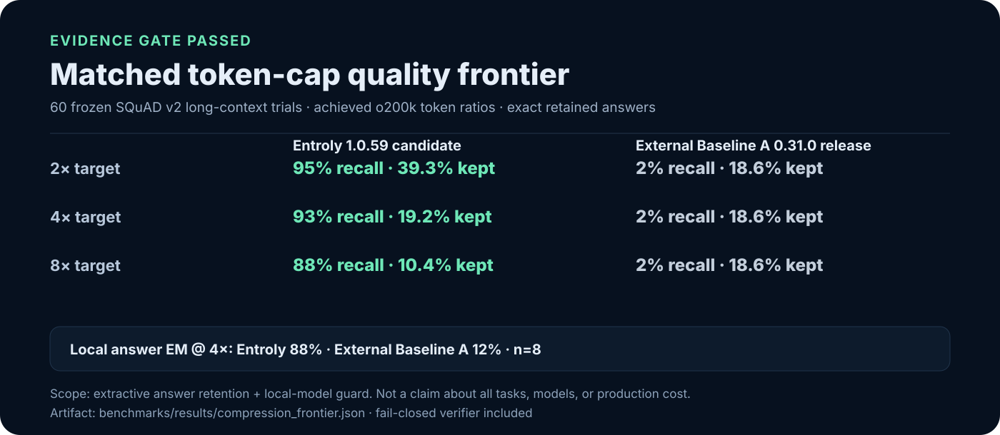
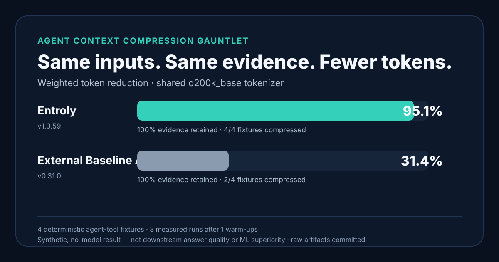

# Entroly — full benchmark evidence

This is the complete, uncut evidence behind the headline numbers in the
[README](../README.md#benchmarks). Every result here links to a committed,
reproducible artifact and states its scope, sample size, and limitations.
Treat each result as evidence for that specific dataset, budget, model, and
commit — not as a guarantee for another repository or workload.

`entroly simulate` uses a local token estimate. Use provider-observed usage
for a billing or production claim.

---

## Context Commit conformance

Synthetic deterministic code fixtures, local, no model or network calls:

| Integrity property | Committed result |
|---|---:|
| Deterministic replay across Python + Rust modes | **128 / 128** |
| Exact recovery of omitted chunks | **576 / 576** |
| Tamper mutations detected | **768 / 768** |

Reproduce: `python -m benchmarks.context_commit_conformance`.
[Raw JSON](../benchmarks/results/context_commit_conformance.json). These numbers
measure artifact integrity, replay, and recovery on the committed fixtures;
they do not measure model-answer quality or claim identical Python/Rust selection.

## Context Efficiency Frontier research

Entroly is building a paired, model-neutral benchmark for the question
token-savings tables cannot answer: does less context preserve real task
quality? The preregistered protocol compares raw context, model-native
compaction, Entroly, and their combination using provider-observed tokens,
cost, latency, task success, evidence recall, and unsupported claims.

[Read the preregistered protocol](benchmarks/context-efficiency-frontier.md).
No headline result will be claimed until the paired confidence bounds pass.

## Matched token-cap active-context quality frontier (1.0.59 source candidate)

Across 60 frozen SQuAD v2 long-context RAG/tool-result trials, without invoking
recovery from the published External Baseline A 0.31.0 baseline's CCR pointers, Entroly
retained **95.0%**, **93.3%**, and **88.3%** of accepted answers at the 2x, 4x,
and 8x token caps. The published External Baseline A 0.31.0 baseline retained
**1.7%** at each cap. The paired two-sided exact McNemar tests pass at every
point (`p <= 4.45e-16`). Entroly met all 180 caps; the baseline met the 2x/4x
caps and exceeded the 8x cap, retaining 18.6% of tokens against the 12.5% maximum.

| Maximum token cap | Entroly answer retained / actual kept | Published External Baseline A 0.31.0 baseline |
|---:|---:|---:|
| 2x (50%) | **95.0% / 39.3%** | 1.7% / 18.6% |
| 4x (25%) | **93.3% / 19.2%** | 1.7% / 18.6% |
| 8x (12.5%) | **88.3% / 10.4%** | 1.7% / 18.6% (above cap) |

A separate eight-question, randomized local `qwen2.5:1.5b` guard at 4x scored
raw context at 62.5% exact match, Entroly at **87.5%**, and the published
External Baseline A 0.31.0 baseline at 12.5%, with no errors. This small local-model sample
is a veto guard, not the headline or a frontier-model claim.

[Generated report](../benchmarks/results/compression_frontier.md) ·
[full auditable artifact](../benchmarks/results/compression_frontier.json) ·
[protocol and reproduction](benchmarks/compression-frontier.md). Verify it
with `python -m benchmarks.compression_frontier verify benchmarks/results/compression_frontier.json`.

<sub>Scope: extractive answer retention in structured SQuAD-v2 RAG results.
The published External Baseline A 0.31.0 baseline's CCR pointers remain in its output, but
retrieval recovery is not run; this measures immediately visible active
context, not External Baseline A's end-to-end CCR workflow. Entroly is measured from the
1.0.59 source candidate; do not call this a released-package result until
1.0.59 is published. This does not establish superiority for every task,
model, compressor, or production workload.</sub>

<p align="center">
  <a href="../benchmarks/results/compression_frontier.md"></a>
</p>

## Same-input compression gauntlet

On four deterministic agent-tool fixtures, current Entroly source (package
version `1.0.59`) and the published External Baseline A 0.31.0 baseline both
retained **100% of the preregistered answer evidence**. Under the shared
`o200k_base` tokenizer, Entroly reduced weighted input tokens by **95.1%**
versus **31.4%** for the baseline's public `compress()` pipeline with its
documented `agent-90` high-savings profile. Entroly compressed all four
fixtures; the baseline compressed two and safely passed two through.

[Generated report](../benchmarks/results/compression_gauntlet.md) ·
[raw inputs and outputs](../benchmarks/results/compression_gauntlet.json) ·
[protocol and reproduction](benchmarks/compression-gauntlet.md). Verify the
artifact with `python -m benchmarks.compression_gauntlet verify benchmarks/results/compression_gauntlet.json`.

<sub>This is a synthetic, no-model compression/evidence result. It does not
measure downstream answer quality or establish neural/ML superiority. The
Context Efficiency Frontier above is the required gate for a real-model claim.</sub>

<p align="center">
  <a href="../benchmarks/results/compression_gauntlet.md"></a>
</p>

## Cross-process recovery holdout

The preregistered six-writer test first exposed a serious Entroly failure
(only 8/32 development payloads survived), which is preserved in the evidence.
The original Entroly 1.0.59 holdout and the immutable v2 revalidation both
recorded Entroly and the published External Baseline A 0.31.0 recovering
**66/66** payloads. On the fresh-seed v4 revalidation of the current
complete-line recovery implementation, both Entroly and the published baseline
recovered **66/66** byte-exactly — both satisfied the frozen integrity gate.
An earlier v3 run recorded a single transient competitor store-lock failure
(55/66) that a clean re-run did not reproduce, so this is parity; it does not
establish universal recovery superiority.

On the current-implementation Windows/Python 3.10 revalidation, the published
External Baseline A 0.31.0 baseline had lower successful store-call latency
(1.524 ms versus 34.848 ms p50). Entroly had lower retrieval latency (0.059 ms
versus 0.441 ms p50) and a smaller live state footprint (95,438 versus
1,626,736 bytes). The baseline used SQLite WAL with `synchronous=NORMAL`;
Entroly fsynced its state file on each commit, so this is not a matched
power-loss durability comparison. These are scoped workload measurements, not
universal claims.

[Frozen protocol and full result table](benchmarks/competitive-evidence-matrix.md)
| [current v4 revalidation](../benchmarks/results/recovery_resilience_holdout_revalidation_v5.json) |
[prior v2 tie](../benchmarks/results/recovery_resilience_holdout_revalidation.json) |
[original post-repair holdout](../benchmarks/results/recovery_resilience_holdout.json) |
[original failing artifact](../benchmarks/results/recovery_resilience_development_before.json).

## Quality-gated compression latency holdout

On the same four deterministic agent-tool fixtures and public entry points as
the gauntlet, Entroly 1.0.59 source was **2.94x faster** than the published
External Baseline A 0.31.0 baseline for warm compressor calls (95% bootstrap
CI **2.74x–3.13x**) and **2.39x faster** for product import plus the first
call in a fresh process (**1.89x–2.70x**). Both systems completed every
fixture, retained 100% of preregistered evidence, remained deterministic, and
never inflated tokens.

[Protocol, per-fixture timings, and limits](benchmarks/compression-latency.md)
| [full holdout artifact](../benchmarks/results/compression_latency_holdout.json)
| [development artifact](../benchmarks/results/compression_latency_development.json).

<sub>Scope: Windows/Python 3.10, synthetic local compression, 120 warm and 40
cold observations per participant. Cold excludes interpreter startup and
includes product import plus first call. This is not provider latency,
downstream answer quality, neural superiority, or universal product
superiority.</sub>

## Model-triggered recovery holdout

After compression for one question, a different future audit question was
revealed to a local `qwen2.5:1.5b` guard. On 24 frozen query-shift cases, raw
context and Entroly both scored **24/24 exact**; the published External
Baseline A 0.31.0 baseline scored **18/24**. All six paired differences
favored Entroly (two-sided exact McNemar **p = 0.03125**). Entroly's mean
effective context ratio, including recovery evidence on every triggered
retry, was **28.88%** versus **42.97%** for the baseline.

Every Entroly row triggered retrieval and recovered a complete source-exact
JSON object. The published baseline answered 18 rows from active context; its
remaining six rows were scored under the frozen no-oracle retrieval rule. The
raw artifact retains every response. The complete artifact passed the
strengthened verifier with zero execution errors.

[Protocol, rejected variants, reproduction, and limits](benchmarks/model-triggered-recovery.md)
| [full holdout artifact](../benchmarks/results/model_recovery_v7_holdout.json)
| [development artifact](../benchmarks/results/model_recovery_v7_development.json).

<sub>Scope: synthetic 48-record JSON audit logs, Windows/Python 3.10, 24
holdout cases, local Qwen2.5 1.5B Q4_K_M at temperature zero. The published
External Baseline A 0.31.0 baseline uses its public `compress()` plus
persistent `CompressionStore` contract; MCP transport is excluded. This is a
scoped workflow result, not evidence about hosted frontier models, every
agent workload, provider cost, or overall product superiority.</sub>

## PRISM-R neural research preview

Frozen evidence-selection benchmark. A generic MiniLM encoder did **not** beat
BM25 as a primary paragraph scorer (97.7% versus 99.0% held-out evidence
recall; paired exact McNemar `p=0.21875`), so Entroly rejects that
neural-primary claim. A disagreement guard kept the answer-bearing passage in
298 of 300 cases while selecting an average of 1.02 of 16 passages. This
experiment measures retrieval of the paragraph containing a known answer; it
does not measure generated-answer quality. In a separate 200-pair query-shift
pilot at a nominal 25% active budget, PRISM-R retained 87.0% of current-query
evidence versus lexical selection's 60.5%; when a different future question
was revealed, exact receipt-backed rehydration raised its evidence retention
from 9.0% to 90.5%. Active plus recovered context was 50.6% of the original.

[Retrieval protocol and limits](benchmarks/neural-evidence-frontier.md) ·
[Research design and prior art](research/prism-r-neural-compression.md) ·
[held-out retrieval artifact](../benchmarks/results/neural_evidence_frontier.json) ·
[query-shift artifact](../benchmarks/results/neural_query_shift.json).

<sub>These are offline exact-evidence pilots on frozen SQuAD v2 subsets. They
do not measure generated answers and are not downstream answer-quality, latency,
production-savings, or general neural superiority claims. PRISM-R is an opt-in
research prototype, is not reachable from a shipped entry point, is not the
default compressor, and remains opt-in research code.</sub>

## Accuracy retention

Does compression hurt answers? Measured with `gpt-4o-mini`; intervals are
Wilson 95% CIs. Each row links its raw result file.

| Benchmark | n | Budget | Baseline | With Entroly | Retention | Token savings |
|---|---|---|---|---|---|---|
| [NeedleInAHaystack](../benchmarks/results/needle_accuracy.json) | 20 | 2K | 100% | 100% | **100%** | **99.5%** |
| [LongBench (HotpotQA)](../benchmarks/results/longbench_accuracy.json) | 50 | 2K | 64% | 66% | **103%** | **85.3%** |
| [Berkeley Function Calling](../benchmarks/results/bfcl_accuracy.json) | 50 | 500 | 100% | 100% | **100%** | **79.3%** |
| [SQuAD 2.0](../benchmarks/results/squad_accuracy.json) | 50 | 100 | 80% | 72% | **90%** | **43.8%** |
| [GSM8K](../benchmarks/results/gsm8k_accuracy.json) | 20 | 50K | 85% | 85% | **100%** | pass-through* |

<sub>*pass-through: context already fit the budget, so Entroly left it unchanged. Reproduce: `python benchmarks/run_readme_benchmarks.py` (needs `OPENAI_API_KEY`). Scope, additional artifacts, and limitations are in the [public evidence ledger](public-evidence.md).</sub>

## Hallucination detection

Committed [HaluEval-QA](https://github.com/RUCAIBox/HaluEval) balanced,
both-answers-scored run:

| Result | Decisions | Accuracy | AUROC | Scope |
|---|---:|---:|---:|---|
| WITNESS full benchmark | 20,000 | 84.92% on the 16,000-decision held-out split | **0.7976** | Local, deterministic verifier |
| WITNESS on the shared GPT sample | 1,200 | 86.58% | 0.8132 | Same sampled decisions used for the GPT rows |
| gpt-4o-mini on the shared sample | 1,200 | 86.25% | not reported | API judge comparison only |

Reproduce: `python benchmarks/halueval_qa_faithful.py`.
[Protocol and raw result](../benchmarks/results/halueval_qa_faithful.json). The
shared-sample accuracies overlap within their reported uncertainty; this result
does not establish superiority, general hallucination prevention, or production
answer quality. The separate [STAVE exploratory result](../benchmarks/results/stave_benchmark.json)
is not used for the headline because it follows a different evaluation setup.

---

## Proof-in-30-seconds videos

Three short, reproducible checks show the value before asking you to trust the
product. These are not mocked terminal recordings: each video is rendered from
a checked-in command that verifies its source artifact before printing a
number.

### 1. The installed path works — without an API key

<p align="center">
  <a href="assets/proof_local.mp4"></a>
</p>

```bash
entroly verify-claims
```

### 2. Tighter context can preserve more answers

> **Using External Baseline A today?** Run Entroly against the same workload and
> compare answer retention, recoverability, state size, and context cost
> locally. The results below use the published External Baseline A 0.31.0
> package as a versioned baseline; they are not a verdict on every External
> Baseline A or Entroly workload.

<p align="center">
  <a href="assets/proof_model_recovery.mp4"></a>
</p>

On the frozen 24-case holdout, Entroly answered **24/24** cases; the published
External Baseline A 0.31.0 baseline answered **18/24**, at **28.88%** versus
**42.97%** effective context. This is a synthetic local Qwen2.5-1.5B test at
temperature 0, not a universal product or model claim. The six discordant
cases favored Entroly (exact McNemar `p=0.03125`).

```bash
python scripts/readme_proof.py model-recovery
```

### 3. Omitted evidence remains recoverable after restart

<p align="center">
  <a href="assets/proof_restart_recovery.mp4"></a>
</p>

The prior v2 run tied at **66/66** and remains published. In the fresh-seed v4
Windows revalidation, both Entroly and the published External Baseline A
0.31.0 baseline recovered **66/66** payloads byte-exactly after restart — both
satisfy the recovery-integrity gate. This is **parity, not leadership**: an
earlier v3 run recorded a single transient competitor store-lock failure
(55/66) that a clean re-run did not reproduce. This is one reproducible run,
not a universal durability claim.

```bash
python scripts/readme_proof.py restart-recovery
```

The animations, MP4s, static frames, source hashes, and commands are bound in
the [proof media manifest](assets/proof_media_manifest.json). Maintainers can
rebuild them with `python scripts/render_readme_proof_videos.py generate` and
reject stale media with `python scripts/render_readme_proof_videos.py verify`.
Rebuilding requires Pillow, `tiktoken`, and FFmpeg; a missing frozen-tokenizer
dependency fails with an actionable install command instead of weakening the
artifact check.

---

## Verifying source-integrity yourself

Context reduction is dangerous when a tool silently changes source text. An
Entroly Context Receipt records the exact source-file SHA-256, UTF-8 byte
range, and fragment SHA-256 for both selected and omitted source fragments. A
receipt holder can recompute those values with `hashlib`; verification does
not call Entroly's hash implementation.

On a pinned, unsampled corpus of **1,104 files in 13 languages**, the installed
native path produced **5,117 / 5,117** fragments whose text, source range,
source digest, and fragment digest all verified. The pure-Python fallback
independently passed **11,986 / 11,986** fragments. Through the public SDK,
**13 / 13** omitted fragments recovered from two pinned source files matched
their recorded source bytes and exact receipt-owned digest.

These are deterministic source-integrity checks, not generated-answer accuracy,
retrieval recall, latency, or provider savings. The full artifacts contain the
denominators, per-file hashes, exclusions, implementation commit, harness hash,
limitations, and checksum sidecars.

```bash
python -m benchmarks.receipt_fragment_fidelity verify benchmarks/results/receipt_fragment_fidelity_default.json
python -m benchmarks.receipt_fragment_fidelity sdk-verify benchmarks/results/receipt_public_integrity.json
```

[Inspect the exhaustive artifact](../benchmarks/results/receipt_fragment_fidelity_default.json)
· [inspect the public-SDK probe](../benchmarks/results/receipt_public_integrity.json)
· [see the capability-to-proof map](capability-coverage.json)
· [submit a counterexample](https://github.com/juyterman1000/entroly/issues/new?template=evidence_report.yml)
