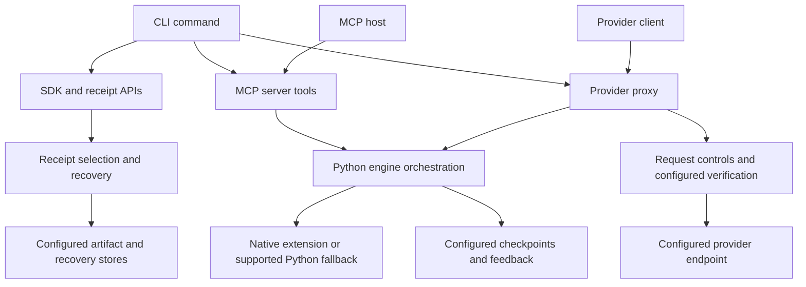

# Entroly architecture

Entroly selects and compresses context, records selection evidence, and exposes
recovery and verification tools. Its interfaces share components, but they do
not execute one universal pipeline. SDK compression, MCP tool calls, and
proxied provider requests have different contracts and failure policies.

This document describes implemented boundaries. Configuration and the tests
linked below determine the behavior of a particular installation. Historical
investigations and benchmarks describe their recorded revisions; they are not
guarantees about every current execution path.

## Entry points and responsibilities

| Surface | Entry and orchestration | Responsibility |
| --- | --- | --- |
| CLI | [`docker_launcher_safe.py`](../entroly/docker_launcher_safe.py), [`cli.py`](../entroly/cli.py), [`cli_parser.py`](../entroly/cli_parser.py) | Resolve launch mode, parse commands, invoke explicit operations, and return their exit status. |
| Python SDK | [`__init__.py`](../entroly/__init__.py), [`sdk.py`](../entroly/sdk.py) | Public compression, retrieval, and message APIs without an HTTP proxy. |
| Context Receipts | [`context_receipts/`](../entroly/context_receipts/) | Index documents, select a bounded evidence bundle, explain omissions, and recover stored content. |
| Context MCP server | [`server.py`](../entroly/server.py) | Bind an engine to a source root and register callable tools. The host chooses which tools to call. |
| Provider proxy | [`proxy.py`](../entroly/proxy.py), [`proxy_config.py`](../entroly/proxy_config.py), [`proxy_transform.py`](../entroly/proxy_transform.py) | Apply request controls, eligible transformations, forwarding, usage observation, and configured response verification. |
| Repository intelligence | [`repository_intelligence/`](../entroly/repository_intelligence/) | Build source facts and dependency projections; expose queries through its own CLI/MCP surface. |
| Work graph | [`work_graph_cli.py`](../entroly/work_graph_cli.py), [`work_graph_mcp_server.py`](../entroly/work_graph_mcp_server.py) | Record task state, provenance, attachments, and recovery across agents. |

Published console entry points are declared in [`pyproject.toml`](../pyproject.toml).
Client adapters and language bindings are separate launch surfaces; their
manifests and distribution tests are part of the supported interface.

## Runtime and language boundaries

[`engine.py`](../entroly/engine.py) coordinates fragment ingestion, selection,
feedback, and persistence. It delegates supported operations to the installed
native extension and has Python fallback paths. These paths are not assumed to
have identical capabilities: [`native_status.py`](../entroly/native_status.py)
and [`runtime_capabilities.py`](../entroly/runtime_capabilities.py) report what
the loaded installation actually provides.

[`entroly-engine`](../entroly-engine/) contains Rust computation and storage
components. [`entroly-core`](../entroly-core/) exposes the Python/native
boundary, [`entroly-qccr`](../entroly-qccr/) provides query-conditioned selection,
and [`entroly-wasm`](../entroly-wasm/) exposes browser/Node bindings. Python
still owns substantial orchestration. Calling it a thin wrapper would hide
where request policy and lifecycle behavior live.

This diagram shows dependencies at a useful reading level, not every import or
an assertion that all clients execute all components.

## Proxy request boundary

`PromptCompilerProxy.handle_proxy` owns the HTTP lifecycle. It checks
rate/session limits, parses the request, identifies its provider shape, applies
policy and eligible transformations, and forwards to the resolved upstream.
The exact order matters: required redaction and emergency rescue must not be
undone by optional cache-prefix preservation.

[`context_boundary.py`](../entroly/context_boundary.py) handles eligible
provider-native sequences. It protects the active turn and tool exchanges,
retains provider system fields, and declines ambiguous or media-bearing
requests. Recoverable omission requires a stored payload and successful
recovery verification before use. Its token count is a local estimate, not a
provider tokenizer or billing guarantee.

Model routing, image optimization, response verification, and recovery retries
have their own configuration gates. In particular, `ProxyConfig.witness_mode`
defaults to `off`: WITNESS does not verify every response automatically.
Enabling an optional feature does not establish quality on a new workload.

## Failure policies belong to boundaries

There is no repository-wide rule that every error forwards the original
request. Preserve the contract at the boundary being changed:

| Boundary | Required behavior and evidence |
| --- | --- |
| Authorization, required redaction, session budgets | Enforce configured refusal or redaction before forwarding. Optional optimization failures cannot bypass these controls. See [`test_proxy_session_budget.py`](../tests/test_proxy_session_budget.py). |
| Recoverable request omission | Do not use a boundary whose recovery cannot be verified. Unsupported shapes retain their original context. See [`test_context_boundary.py`](../tests/test_context_boundary.py). |
| WITNESS | Respect the workload profile and enforcement mode. Verification failure must not be reported as successful proof. See [`test_witness_fail_closed_audit.py`](../tests/test_witness_fail_closed_audit.py). |
| RAVS routing | Missing evidence, disabled routing, or an invalid gate retains the original model; fail-closed routing means refusing an unproven downgrade. See [`test_ravs_v3.py`](../tests/test_ravs_v3.py). |
| Provider forwarding and streams | Propagate bounded, observable failures rather than claiming completion or silently retrying outside the configured policy. See [`test_proxy_stream_bounds.py`](../tests/test_proxy_stream_bounds.py). |
| Diagnostics | Describe local capability/configuration; preserve a nonzero exit for unhealthy state. A healthy local report does not certify provider connectivity or production readiness. See [`test_runtime_doctor.py`](../tests/test_runtime_doctor.py). |

Receipts record the scope of a selection or transformation. They are not a
single trace guaranteed to traverse every interface, nor proof of answer
correctness, provider savings, or successful downstream use.

## Persistence and external calls

Storage is configured per subsystem. Engine checkpoints use
`EntrolyConfig.checkpoint_dir`: `ENTROLY_DIR` overrides the default project hash
under `~/.entroly/checkpoints/`, with a temporary-directory fallback when the
default is unwritable. Context Receipts resolve `.entroly/receipts` upward to a
repository boundary. Other ledgers and recovery stores have their own explicit
paths. Project isolation does not imply that every byte is stored beneath the
repository root, or that all stores share one retention/encryption policy.

Raw source, prompts, receipts, and recovery payloads require the same care as
their inputs. Keep them out of committed instructions, sample fixtures, and
logs unless intentionally public. See [`SECURITY.md`](../SECURITY.md) for
reporting and deployment guidance.

Provider forwarding makes a network call. Verification backends, configured
telemetry uploads, dependency acquisition, and explicitly enabled update checks
can also use the network. [`product_telemetry.py`](../entroly/product_telemetry.py)
requires consent and honors its disable/air-gap controls; this is not a blanket
network-isolation guarantee for every integration. Review the selected launch
path and configuration for offline deployments.

## Reviewing a change

Start with the public trigger, follow the actual handler, then inspect the
storage and policy boundaries it crosses. Use
`python scripts/codebase_graph.py --json graph.json` for static imports; add
container or library launch modules with `--entry-point`. Static cycles include
lazy and conditional imports, and statically unreached modules may be public
APIs. Neither result alone justifies deletion.

Run tests for the affected contract before broad suites. Native or distribution
changes also need binding/package checks. Record the tested configuration and
revision, distinguish local estimates from provider usage, and make rollback
possible. Contributor setup is in [`CONTRIBUTING.md`](../CONTRIBUTING.md).
