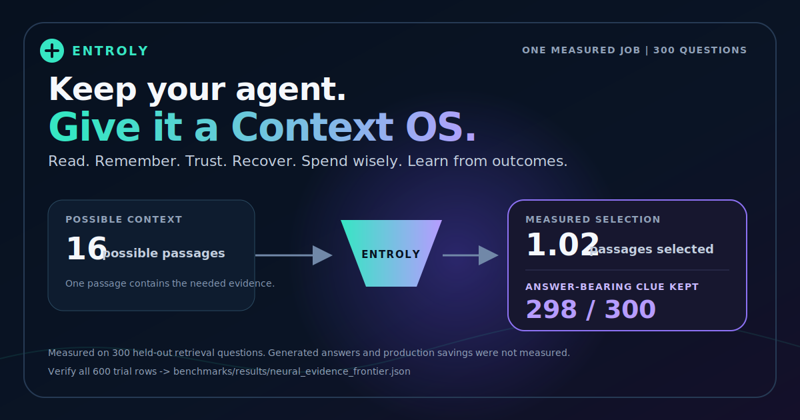

# The transformer lost. We published the result anyway.

<p align="center">
  <a href="../../benchmarks/results/neural_evidence_frontier.json"></a>
</p>

Entroly tested a tempting idea: replace deterministic lexical retrieval with a
local transformer for answer-bearing context selection. On this frozen
holdout, that idea did not earn the right to ship.

The useful result was the disagreement. Keeping lexical retrieval primary and
retaining both champions only when the lexical and neural rankings disagreed
recovered one additional answer-bearing passage while selecting only `1.02`
of `16` passages on average. That guard result is promising, not statistically
conclusive.

## What was frozen

- Dataset: SQuAD v2 validation, fingerprint `461c0301636b3e0b`
- Protocol: 600 deterministic trials, split into 300 calibration and 300 held-out trials
- Candidates: one answer-bearing paragraph and 15 distractors per trial
- Encoder: `sentence-transformers/all-MiniLM-L6-v2`
- Encoder revision: `c9745ed1d9f207416be6d2e6f8de32d1f16199bf`
- Model tree SHA-256: `3efc859f2086261cc877fff243cddd2e4532e55e4157747861f705cd36b05a13`
- Source commit: `0dc83f1f7759d7ace58cfc2d7ae19380473452f1`
- Runtime: Python 3.10.0, `datasets==4.8.4`, `sentence-transformers==5.1.1`, `torch==2.8.0+cpu`

## Held-out result

| Selector | Top-1 answer-passage recall | Top-2 recall | MRR |
|---|---:|---:|---:|
| Deterministic BM25 | **99.0%** | 99.7% | 0.9937 |
| Local transformer | 97.7% | 99.7% | 0.9870 |
| Dual-channel disagreement guard | **99.3%** | n/a | n/a |

The transformer was uniquely correct once; BM25 was uniquely correct five
times. Their paired two-sided exact McNemar value was `p=0.21875`, so the
benchmark does not support a statistically significant primary-selector claim.
The guard selected both passages for the six disagreements and reached `298 / 300`
answer-passage recall, equivalent to `15.69x` passage-count compression in this
one-of-16 protocol.

This experiment measures retrieval of the paragraph containing a known answer.
It does not measure generated-answer quality, token compression, production
latency, billing savings, or universal neural-versus-lexical superiority.

## Audit every trial in under a minute

From a source checkout:

```bash
python -m benchmarks.neural_evidence_frontier verify \
  benchmarks/results/neural_evidence_frontier.json
```

The verifier recomputes correctness, recall, MRR, disagreement counts, the
exact McNemar value, the guard result, and the headline gate from all 600 raw
trial rows. It fails if the committed aggregates or statistical conclusion do
not match those rows. This audits the committed experiment; it does not rerun
the transformer.

## Rerun the encoder experiment

Materialize the exact model revision and SQuAD v2 dataset in the local Hugging
Face cache first. The runner is deliberately offline-only and refuses an
implicit download. Then run:

```bash
python -m pip install -e ".[benchmark]"
python -m benchmarks.neural_evidence_frontier run \
  --model-path /path/to/c9745ed1d9f207416be6d2e6f8de32d1f16199bf \
  --model-repository sentence-transformers/all-MiniLM-L6-v2 \
  --model-revision c9745ed1d9f207416be6d2e6f8de32d1f16199bf \
  --implementation-commit "$(git rev-parse HEAD)" \
  --trials 600 --distractors 15 --seed 73021 \
  --calibration-fraction 0.5 \
  --max-override-error-upper 0.10 --minimum-overrides 40 \
  --output .tmp/neural_evidence_frontier.json \
  --markdown .tmp/neural_evidence_frontier.md \
  --svg .tmp/neural_evidence_frontier.svg
```

Compare the dataset fingerprint, model-tree fingerprint, trial rows, and
metrics with the committed artifact. Platform-specific floating-point behavior
should be investigated rather than silently normalized away.

## Try to falsify it

The most valuable response is not a star or a repost. It is a corpus where the
result changes. Run lexical, neural, and disagreement-gated selection on your
own evidence workload and submit a
[Benchmark or Evidence Report](https://github.com/juyterman1000/entroly/issues/new?template=evidence_report.yml).
Include the corpus or immutable hashes, selector versions, budget, trial-level
outcomes, and failure cases. Entroly will publish credible counterevidence next
to favorable evidence.

- Raw evidence: [`neural_evidence_frontier.json`](../../benchmarks/results/neural_evidence_frontier.json)
- Generated report: [`neural_evidence_frontier.md`](../../benchmarks/results/neural_evidence_frontier.md)
- Research design: [`prism-r-neural-compression.md`](../research/prism-r-neural-compression.md)
