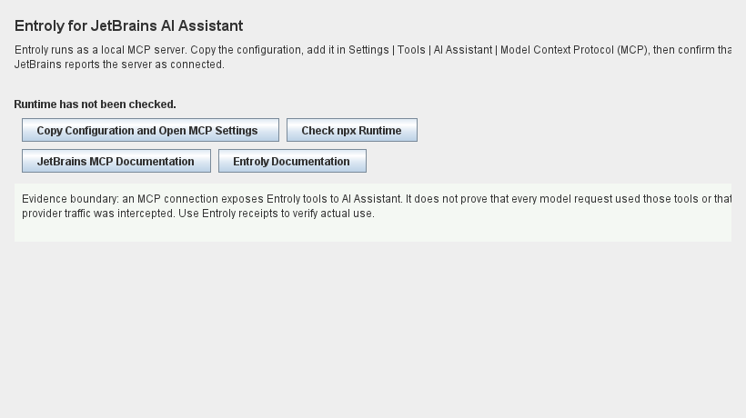

# Entroly for JetBrains IDEs

This free, open-source plugin connects JetBrains AI Assistant to Entroly's
local MCP server without silently changing IDE settings or installing software.



## User flow

1. Install the Entroly plugin from JetBrains Marketplace.
2. Choose **Tools | Configure Entroly for AI Assistant**.
3. The plugin copies a version-pinned MCP configuration and opens
   **Settings | Tools | AI Assistant | Model Context Protocol (MCP)**.
4. Add the copied JSON, click **Apply**, and confirm JetBrains reports the
   server as connected.
5. Ask AI Assistant to use Entroly, then inspect Entroly receipts to confirm
   that it actually ran.

Node.js and `npx` are required for the zero-account MCP package path. The
plugin's settings page can check `npx --version`; it does not download anything
during that check. The first MCP start may download the public
`entroly-mcp` npm package after the user accepts the configuration in JetBrains.

MCP availability is not proof that every model request used Entroly. JetBrains
AI Assistant decides when to call MCP tools, and provider traffic remains owned
by JetBrains unless the user configures a separate measured proxy path.

## Privacy and security

- No telemetry or analytics.
- No credentials are collected or stored.
- No IDE files or AI Assistant settings are modified automatically.
- No network call occurs until the user opens documentation or starts the MCP
  server from JetBrains.
- The MCP server runs locally with passive mode and a 200-file scan bound.

## Build and verify

The build requires Java 21. From this directory:

```console
./gradlew test buildPlugin verifyPluginStructure verifyPlugin
```

On Windows, use `gradlew.bat`.

The Marketplace archive is written to `build/distributions/`. The plugin
version is read from the repository's root `pyproject.toml` so product and
plugin versions cannot drift.

## Marketplace publication

The first release must be uploaded through the JetBrains Marketplace vendor
dashboard so the publisher can accept the Developer Agreement, choose trader
status, select the Apache-2.0 license, and link the public source repository.
Subsequent updates can use the Gradle `publishPlugin` task with a
`PUBLISH_TOKEN` environment variable. Signing credentials are read from
`CERTIFICATE_CHAIN`, `PRIVATE_KEY`, and `PRIVATE_KEY_PASSWORD` when present;
secrets must never be committed to the repository.
